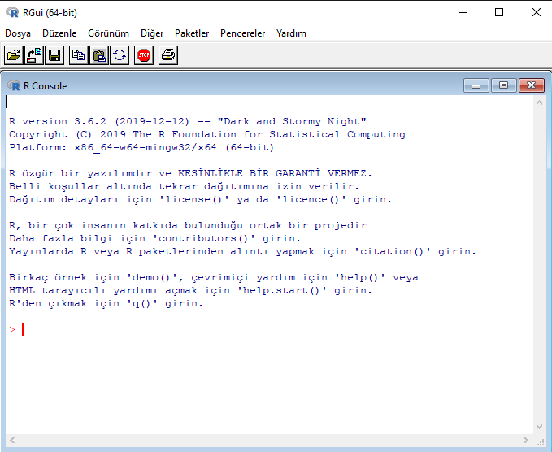
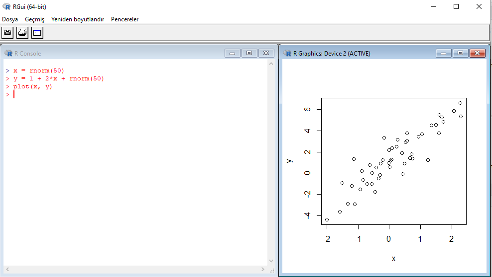

<style type="text/css"> 
body{
  background-color: #FAFAFA;
  font-size: 18px;
  line-height: 1.8; 
}
code.r{
  font-size: 12pt;
}
</style>

```{r setup, include=FALSE}
# knitr::opts_chunk$set(echo = TRUE, results = 'asis', fig.show = 'asis')
knitr::opts_chunk$set(echo = TRUE, message=FALSE, warning=FALSE)
``` 

<br/>
<br/>


# R and RStudio Environment

`RStudio` provides an excellent interface that makes working with `R` whole lot easier. If you haven't done so, please first install the latest version of `R` before you install RStudio. 

1. Visit [The Comprehensive R Archive Network](https://cran.r-project.org/) to download and install `R`. You should be able to see something like: 

 

At this stage, you can actually start using basic functions of R, for example,  



But there is a much easier alternative to run and manage R programs. `RStudio` provides an excellent IDE. Now, go ahead and

2. Visit [RStudio](https://rstudio.com/), download the latest version and install. 

Now, you're ready to launch RStudio. You will see 4 windows. 


<br/>

To open a new `R` script file, Click File > New File > R script. This will be your first R script. `R` script is basically a text file in which you organize your commands and codes. 

The bottom left window is the command "Console" in which you can execute your 
codes. For example, you can use R as a calculator, define and draw functions. 

# R Console

On the console just type
```{r}
2 + 2
```
```{r}
pi
```

Or

```{r}
log(exp(-5))
```
```{r}
e <- exp(1)
print(e, digits = 3)
```
```{r}
e <- exp(1)
print(e, digits = 17)
```

Well, no surprises there. Now let's try computing the number $a = (9\times 8.1) + 8.1$ which is simply 
$10\times 8.1 = 81$. Because multiplication has precedence over addition unless there is a parenthesis,  we have
```{r}
a <- 9*8.1 + 8.1
print(a)
```

But look at the digits after zero: 
```{r}
print(a, digits = 17)
```

This means the number 81 cannot be represented exactly in a computer which uses binary representation. The error in representing 81 is 
```{r}
print(81-a, digits = 17)
```

which is just $1.4210854715202004\times 10^{-14}$,  or 
```{r}
format(81-a, scientific = FALSE)
```

Is this a problem? Well, it depends on your purpose and context. Suppose that you wanted to compare the output of the arithmetic operation to a known result. We can use logical operators for that (more on this below). Consider 
```{r}
81 == a
```

This is just another way of saying that two numbers are not exactly equal. But they are nearly equal:  
```{r}
all.equal(81,a)
```

with the default tolerance level of $0.000000015$. In other words, the difference between 81 and the number `a` is less than the tolerance level. In passing, I note that the machine precision (sometimes called epsilon, $\epsilon$) in R is 
```{r}
print(.Machine$double.eps, digits=22)
```

**Exercise:** Find the largest number that can be represented in the computer smaller than 1. 
```{r, echo=FALSE, eval=FALSE}
eps <- .Machine$double.eps
u <- 1-eps
print(u, digits=22) 
u<1
```


Other arithmetic operations can be problematic as well. Try subtracting 10.1 from 10.2: 
```{r}
b <- 10.2 - 10.1
print(b, digits = 17)
```

which is not exactly $0.10$. 

**Exercise** Show that the binary representation of 81 is $(1010001)$, i.e., $(81)_{10} = (1010001)_2$. Also find the binary representation of $0.10$. 


# Packages

The base `R` comes with the following packages: 
```{r}
rownames(installed.packages(priority="base"))
```

`R`'s functionality can easily be extended by including software packages written by other `R` users. For example, we can install the data package for our textbook by typing the following code at the very top of the script (mind the quotation mark):

```{r eval=FALSE, message=FALSE, warning=FALSE, paged.print=FALSE} 
install.packages("ISLR", repos='http://cran.us.r-project.org')
```

Alternatively, this can be done using `Tools>InstallPackages` from the menu and then typing "ISLR" on the search window. We basically downloaded this package into our computer. Now we can activate whenever we need it. To tell `R` that we will use we need a further command:

```{r message=FALSE, warning=FALSE, paged.print=FALSE}
library(ISLR)
```

This instructs `R` that our code needs to access contents of that package. Note that there is no quotation mark. 

# File Names and Working Directory

Use `getwd()` to see the current directory. If we want to change 
it we can use setwd(path) where path should be defined usign forward slash /, instead of backslash, \. 
```{r, eval=FALSE, echo=TRUE}
getwd()
```
 If we want to change 
it we can use `setwd("/full/address/")` where path should be defined using forward slash `/`, instead of backslash, `\`. 
```{r, eval=FALSE, echo=TRUE}
setwd("C:/Users/Folder/Another-Folder/MLinEcon")
```


# Objects in `R` 

`R` is case-sensitive so `x` and `X` are different objects. The content of an object is assigned using `<-` for example: 

```{r}
x <- 5 
y <- 2 
z <- x^y 
z 
```

Note that the equation sign can also be used but I suggest using `<-` (don't forget to put a single space before and after). 

List of all currently available objects in the memory can be accessed using the command `ls()`

```{r}
ls()
```

Also see the `Environment` window in RStudio. 

The command `rm(x)` removes the object `x` from the memory. If you want to remove all objects, you can use `rm(list=ls())`. 

```{r}
rm(list=ls())
ls()
```


## Vectors 

An `R` vector (or an atomic vector -not an algebraic vector-) is just a collection of objects. A vector my contain numeric elements (integers and doubles), logicals, and characters. A vector can be defined in a number of ways. For example, we can use `c()` to create vectors `a` and `b`  

```{r}
a <- c(1,2,3,4,5)
a
b <- c(1,1,1,1,1)
a+b
integer <- c(10L, 20L)
typeof(a)
typeof(integer)
```

```{r}
char1 <- c("small", "medium", "large")
char1
typeof(char1)
```

Let `score` be a vector with 10 elements containing evaluations on a new product out of 100 points. 

```{r}
score <- c(80, 65, 78, 94, 100, NA, 55, 85, 88, 75)
print(score)
NROW(score)
length(score)
```


Some of the widely used `R` functions for vectors are illustrated below:

```{r, eval=TRUE}
# number of elements in a vector 
length(a)
# sort elements 
sort(score)
# maximum 
max(a)
# minimum
min(a)
# sum of the elements 
sum(a)
# product of the elements 
prod(a)
# vector of n zeros
numeric(5)
# create an n-vector with all elements a: rep(a, n)
rep(1,10)
# seq(T): create an integer sequence from 1 to T
seq(10)
# seq(t,T) similarly create a sequence from t to T
seq(5,10)
# seq(t,T,s) create a sequence from t to T by increment s
seq(1,10,2)
```

The elements of a vector can easily be accessed. 
```{r}
# first element 
score[1]
# first three elements
score[1:3]
# last element 
n <- length(score)
score[n]
# last three elements
score[(n-3):n]
```

**Exercise** Instead of running `score[(n-3):n]` use `score[n-3:n]`
```{r}
score[n-3:n]
```

Explain the output above. 

**Exercise** Find the index of `NA` in the vector `score` and eliminate it. Call the new vector `score2`. 

**Solution** The easiest way is to use two built-in functions `which()` and `is.na()` together. `is.na()` returns `TRUE` (more on that below) for `NA` entries, and `FALSE` otherwise.
```{r}
# is an element NA ?
is.na(score)
```

`which()` returns the index number, i.e., the position of the `NA` element in the vector. 
```{r}
# what's the position of NA 
which(is.na(score))
```

Or, find the positions of entries that are not `NA`: 
```{r}
# indices of numeric elements (excluding NAs)
which(!is.na(score))
```

where we simply used the negation `!is.na()`. Now, exclude `NA` and create a new vector: 
```{r}
score2 <- score[which(!is.na(score))]
score2
```

Actually, using `which()` is redundant in this case (unless we want to retain intermediate steps): 
```{r}
score2 <- score[!is.na(score)]
score2
```

The function `na.omit()` can also be used to drop missing observations (to be discussed later).  

A vector with **logical elements**: 
```{r}
logic1 <- c(TRUE, FALSE, TRUE)
print(logic1) 
```

Note that `TRUE` and `FALSE` are reserved in `R`. Here is the numerical representation of a logical vector: 
```{r} 
as.numeric(logic1) 
```

We can use logical operators, `==`, `>`, `<`, `>=`, `<=` ,`!=`, to create vectors with logical entries. For example, 
```{r} 
score_less_than70 <- (score < 70)
score_less_than70
```

We can easily extract the contents of `score` than satisfy `score<70` using logical subscripting. 
```{r}  
score
score[score_less_than70]
```


## Matrices 

We can create matrices in a number of ways. If we want to create a matrix based on an existing vector we can use the following command:

```{r}
A <- matrix(data=score, nrow=10, ncol=1, byrow=FALSE, dimnames=NULL)
print(A)
dim(A)
```

We can change the dimensions of the matrix, for example: 

```{r}
B <- matrix(data=score, nrow=5, ncol=2, byrow=FALSE, dimnames=NULL)
print(B)
dim(B)
```

which gives us a $5\times 2$ matrix using `byrow=FALSE` option. 

The transpose of a matrix can be found using `t()` function:   

```{r}
t(B)
```

The position of the missing element can be accessed using 
```{r}
is.na(B)
# the position of NA
which(is.na(B))
```

The position is determined column-wise. For example, consider the following 
```{r}
C <- t(B)
is.na(C)
# the position of NA
which(is.na(C))
```


Sometimes we want to create a blank matrix to be filled later in a loop. For example, 
to create a matrix of zeros use

```{r}
zeros <- matrix(data = 0, nrow = 5, ncol = 5)
```

The functions `cbind` and `rbind` can be used to create rectangular arrays (matrices). For example 

```{r}
x <- cbind(b,a)
# also check out the following
cbind(1,1:5)
```

Let us define another column vector that contains gender:

```{r}
gender <- c("Female", "Male", "Female", "Female", "Male", "Female", "Male", "Male", "Female", "Female")
print(gender) 
table(gender)
```

Think of `gender` as a categorical variable. Each observation is assigned to a gender category. 


Let us combine these two pieces of information, scores and gender, and call it `x`: 

```{r}
x<- cbind(score,gender)
x
```

Note that all elements are strings (why?). 

You can save these objects for later use: 

```{r}
save(score, gender, B, b, x, file = "../Data/myfirstRdata.RData")
```

Reload them using: 
```{r}
load("../Data/myfirstRdata.RData")
```

We combine vectors and matrices having the same dimensions into a special type of object called data frame. For example

```{r}
mydata<- data.frame(score,gender)
mydata
names(mydata)
str(mydata)
summary(mydata)
```

We will revisit data frames in the next lab session. 

## Logical vectors revisited

As we mentioned above, `TRUE` and `FALSE` are reserved words in `R` indicating whether a given statement is true or false. Internally, `TRUE` (T) is set to 1 and `FALSE` (F) is set to 0. Try the following commands yourself
```{r}
# logical operators, ==, !=, >, <, >=, <=
0 == 0
0 == 1
a >= 3
# note what happens if you type 
1-(a<=3)
```

We can create logical vectors using the function `logical()`, or using conditional statements on existing vectors. For example, 
```{r}
# logical creates a vector in which each element is zero
logical(5)
```
```{r}
# Which observations are Male
gender=="Male"
```
```{r}
# indicate scores higher than or equal to 75
ind <- (score>=75)
cbind(score, ind)
```


## Lists 

A __list__ is a general grouping of any kind of objects in `R` and it can have different types of the components. 
```{r, }
# Generate a list object:
mylist <- list( A=seq(8,36,4), this="that", idm = diag(3))
# Print the list: 
mylist
```

In order to name the components __names()__ command may be used.
```{r}
names(mylist)
```

Also a specific component can be refered by __list_name$component_name__.
```{r}
# Print component "A":
mylist$A
```


# Visualization: Defining and drawing curves

On the console type `help(curve)` or `?curve`: 
```{r, eval=FALSE}
?curve
```
```{r}
# a linear function
curve(1+2*x, from=-2, to=2, xlab="x", ylab="" )
# add a quadratic function
curve(1+2*x-2*x^2, add = TRUE, col = "red" )
# cubic
curve(1+2*x-2*x^2+3*x^3, add = TRUE, col = "blue" )

```

Another way of visualizing an algebraic function is to use `function()` and `curve()` or `plot()` together. 
```{r}
# Define the function (this is your first function here !)
fun1 <- function(x) 2*sin(x)+cos(x)
curve(fun1, -pi, pi, n = 100) 
```
```{r}
# focus on the interval -2 < x < 2
plot(fun1, -2, 2)
```


# Resources 

Basic R: [Swirl](https://swirlstats.com/students.html)

[RStudio Beginners Starting Point](https://education.rstudio.com/learn/beginner/)

Datacamp course: Introduction to R. (assignment) 


<div class="tocify-extend-page" data-unique="tocify-extend-page" style="height: 0;"></div>

