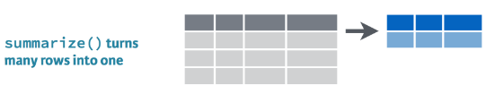
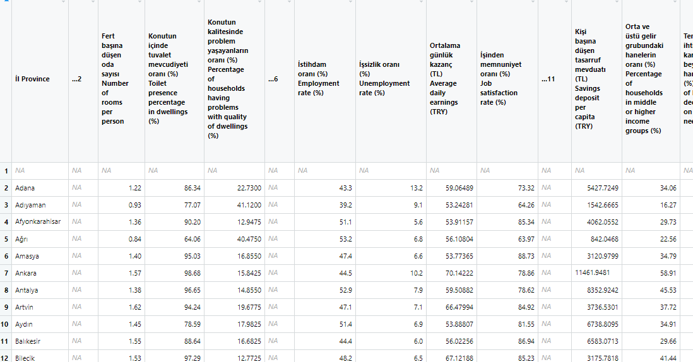

<style type="text/css"> 
body{
  background-color: #FAFAFA;
  font-size: 18px;
  line-height: 1.8; 
}
code.r{
  font-size: 12pt;
}
</style>

```{r setup, include=FALSE}
# knitr::opts_chunk$set(echo = TRUE, results = 'asis', fig.show = 'asis')
knitr::opts_chunk$set(echo = TRUE, message=FALSE, warning=FALSE)
``` 

<br/>
<br/>


# Tidyverse: A modern interpretation of R 


[Tidyverse](https://www.tidyverse.org/) is a collection of packages designed to implement data science projects. These notes provide a basic introduction to  the functions and verbs in the Tidyverse. The fundemantal reference for Tidyverse is the book [R for Data Science](https://r4ds.had.co.nz/) written by H. Wickham. Also, see [*Tidy Data*](https://vita.had.co.nz/papers/tidy-data.pdf) (Hadley Wickham, 2014 JSS), and [Tidy data Vignette](https://cran.r-project.org/web/packages/tidyr/vignettes/tidy-data.html)  


  


```{r}
# install.packages("tidyverse")
library(tidyverse)
```


`library(tidyverse)` activates all of the following packages: 

* `ggplot2`, data visualization

* `dplyr`, data manipulation

* `tidyr`, "tidy"ing data

* `readr`, reading data

* `purrr`, functional programming

* `tibble`, tibbles (a modern interpretation of `data.frame`)

* `stringr`, manipulating character variables

* `forcats`, manipulating factor variables

<br/>
<br/>

What is a **tidy** data set?  A **tidy** data set has a consistent (rectangular) structure in which each variable is a column and each row is an observation. After importing the data into R, we can transform it so that it has a tidy structure. Then, we can focus on the analysis.
![An Example (source: [R for Data Science]<https://r4ds.had.co.nz/tidy-data.html>)](img/tidy.png)  


As an example, consider the `gapminder` data set which is available in the package with the same name.  
```{r}
library(gapminder)
head(gapminder)
```

`gapminder` is a **tibble**, a special type of data frame. It is different from the traditional `data.frame` in some aspects that make handling data a little easier.

Creating a tibble is easy. We can use `tibble::tibble()` function for this as follows: 
```{r}
tibble(
  x = 1:5, 
  y = 1, 
  z = x ^ 2 + y
)
```

Here is another example:  
```{r}
df <- tibble(
  xvariable = runif(5),
  depvariable = 2+ 5*xvariable + rnorm(5)
)
df
```

As in the base `R`'s `data.frame()` function, we can access variables in a  `tibble` using:  
```{r}
# extract by column name
df$xvariable
```
```{r}
# extract by column name
df[["xvariable"]]
```
```{r}
# extract by column position
df[[1]]
```

But there are easier ways of accomplishing these as I will show below. 

# `dplyr` Function

Using several functions in the `dplyr`, we can easily manipulate data. These functions are sometimes called "verb" as they basically do what their names suggest, for example, filter, select, mutate, summarize, arrange, etc. 

## `filter()` 

`dplyr::filter()` function can be used to select rows (filter) and create a new table or data set.


**Task**: Extract a given country's data from the `gapminder` data set, for example, Turkey. Upon inspection we see that Turkey is located between rows  1573 and 1584. Using this information we can create: 
```{r}
(turkey <- gapminder[1573:1584,])
```

But this approach is not advisable as it is prone to error. Intead we use `dplyr::filter()` function. The input of `filter()` verb is a set of logical expressions. For example: 
```{r}
filter(gapminder, country == "Turkey")
```

Notice that this is similar to the `subset()` function in base `R`.  

`filter()` allows using more than one logical expression For example, let's create a table for Turkey using only observations after 2000: 
```{r}
filter(gapminder, country == "Turkey", year>2000)
```

**Task**: Extract both Turkey and Brazil for the post-2000 period: 
```{r}
filter(gapminder, country %in% c("Turkey","Brazil"), year>2000)
```

## `select()` 


When we want extract columns (variables) from a data set we use  `dplyr::select()` function. 
```{r}
select(gapminder, year, gdpPercap) %>% head(10)
```

**On Pipe (` %>% `) Operator**:

The pipe operator ` %>% `, or function, is originally a part of `magrittr` package. It is automatically loaded when we load the tidyverse packages. The pipe operator allows computations to run from left to right in a smooth and easily readable manner. For example 
```{r}
gapminder %>% select(year, gdpPercap) %>% head(5)
```
which is equivalent to 
```{r}
head(select(gapminder, year, gdpPercap), 5)
```

The code chunk with the pipe above takes the `gapminder` data and feeds it into `select()` function which is then passed on to the `head()` function to display the first five rows. Note that when we use the pipe operator, the first input is the data. 


Example: Use `select()` and `filter()` together using the pipe operator. 
```{r}
gapminder %>% filter(country %in% c("Turkey","Brazil"), year>2000) %>% 
  select(year, gdpPercap)
```

**Exercise**: Use the base `R` functions for the previous example 

**Solution**: There are often several ways to do the same thing in `R`. Here is a solution: 
```{r}
gapminder[gapminder$country  %in% c("Turkey", "Brazil") & gapminder$year>2000, c("year", "gdpPercap")]
```
Can you explain what this code does?


## `mutate()` 


We use `dplyr::mutate()` to create new variables or change existing ones. The functions inside `mutate()` must be vectorized, that is, both inputs and outputs must be vectors. 

Example: Create natural logarithm of GDP per capita:   
```{r}
mutate(gapminder, lgdppc = log(gdpPercap)) %>% head(5)
```

Example: In the data set there is GDP per capita and population but no GDP. Create the GDP variable. 
```{r}
mutate(gapminder, gdp = gdpPercap*pop ) %>%
  select(year, country, gdpPercap, pop, gdp) %>% 
  head(5)
```

To change the name of existing variables we use `rename()` function. 

## `arrange()`  


We use `dplyr::arrange()` to rearrange the rows of data. 

Example: Order year in ascending, countries in alphabetical order: 
```{r, echo=TRUE}
arrange(gapminder, year, country) 
```
It does not change the data set, just orders it. We need to be careful when we have time series data. 

Example: First order countries and then years in ascending order:  
```{r}
arrange(gapminder, country, year) 
```

Default = ascending. If we want descending order use: 
```{r}
arrange(gapminder, country, desc(year)) %>% head(5)
```


`filter()` and `arrange()` can be used together. For example, 
```{r}
gapminder %>% 
  filter(year==2007, continent=="Americas") %>% 
  arrange(lifeExp) 
```

Example: Life expectancy in Europe in 2007 in descending order: 
```{r}
gapminder %>% 
  filter(year==2007, continent=="Europe") %>% 
  arrange(desc(lifeExp)) 
```

## `group_by()`

This function is useful to group variables. It does not change the data. `group_by()` is especially useful together with summarize()`. 
```{r}
gapminder %>%  
  group_by(continent, year)  
```

## `summarize()`

 

We  `dplyr::summarize()` to compute summary statistics of our variables. By grouping variables using `group_by()` we can conveniently compute group summaries. 


Example: How many countries are there in each continent in 2007?
```{r}
gapminder %>% 
  filter(year==2007) %>%
  group_by(continent) %>%
  summarize(n = n())
```

Example: Find average life expectancy and GDP percapita according to continents in 2007. 
```{r}
gapminder %>% 
  filter(year==2007) %>%
  group_by(continent) %>%
  summarize(mean_life_exp = mean(lifeExp), mean_income = mean(gdpPercap))
```

Alternatively, `summarize_at()` may be useful to compute summary statistics for multiple variables: 
```{r}
gapminder %>% 
  filter(year==2007) %>%
  group_by(continent) %>%
  summarize_at(vars(lifeExp,gdpPercap), list(~mean(.)) )
```

Example: Do the same for years 1952 and 2007 compare the means: 
```{r}
gapminder %>% 
  filter(year %in% c(1952,2007)) %>%
  group_by(continent, year) %>%
  summarize_at(vars(lifeExp,gdpPercap), list(~mean(.)) )
```

Note that we made the grouping in terms of two variables using `group_by(continent, year)`.

We can use the following standard summary statistics: `mean()`, `median()`, `var()`, `sd()`, `mad()`, `IQR()`, `min()`, and `max()`.

**Example**: For each year, find minimum and maximum life expectancy in Europe.  
```{r}
gapminder %>% 
  filter(continent=="Europe") %>%
  group_by(year) %>%
  summarize(minlexp = min(lifeExp), maxlexp = max(lifeExp) )
```

**Example**: Using `mutate()` and  `group_by()` together. For each country, create a new variable that shows the ratio of GDP per capita to the initial year 1952. The new variable will be 1 in 1952 and equal 1+growth rate with respect to the initial year..   
```{r}
gapminder %>%  
  group_by(country) %>%
  select(country, year, gdpPercap) %>% 
  mutate(gdppc_to_first = gdpPercap/first(gdpPercap))
```


**Example**: Now create a new variable for the year-to-year growth rate in GDP per capita as a percentage.
```{r}
gapminder %>%  
  group_by(country) %>%
  select(country, year, gdpPercap) %>% 
  mutate(gdppc_growth = 100*(gdpPercap-lag(gdpPercap))/lag(gdpPercap))
```

In the example above, the `lag()` function takes the first lag (value in the previous year). We can also add the lag explicitly as a new variable:
```{r}
gapminder %>%  
  group_by(country) %>%
  select(country, year, gdpPercap) %>% 
  mutate(lag_gdppc = lag(gdpPercap, 1, order_by = year), 
         gdppc_growth = 100*(gdpPercap-lag_gdppc)/lag_gdppc)
```


Back to the usefulness of the  **pipe** operator. Try to do the previous task without the pipe: 
```{r}
mutate(select(group_by(gapminder,country), country, year, gdpPercap), gdppc_growth = 100*(gdpPercap-lag(gdpPercap))/lag(gdpPercap))
```
Which one would you prefer?  

**Example**: Create a new tibble containing minimum and maximum life expectancy in Europe together with country information:   
```{r}
europe <- gapminder %>% 
  filter(continent=="Europe") %>%
  select(year, country, lifeExp) 
europe %>% head(10)
``` 

Then, create a new variable for the ordered life expectancy using `min_rank()` and list the first few countries: 
```{r}
europe %>% 
  group_by(year) %>% 
  mutate(le_rank = min_rank(lifeExp)) %>% 
  filter(le_rank < 3) %>% 
  arrange(year)
```

Do the same for the highest life expectancy countries: 
```{r}
europe %>% group_by(year) %>% 
  mutate(le_desc_rank = min_rank(desc(lifeExp))) %>% 
  filter(le_desc_rank < 3) %>% 
  arrange(year)
```

**Exercise**: Create a table that shows minimum and maximum life expectancy together.  


# Cleaning data using `tidyr` 

## On data organization 

```{r}
library(readxl)
trdata1 <- read_excel("../Data/trdata1.xlsx") 
trdata1
```

`trdata1.xlsx` contains data on three provinces in Turkey (İstanbul, İzmir, Ankara) for three years (2005, 2010, 2015). Variables are nominal per capita GDP (GDPpc), real per capita GDP (RGDPpc), nominal per capita GDP in US$ (GDPpc_USD) and population. 

This data set is not in tidy form. We have variables in rows. We need to convert this into a tidy form. 
 

Grolemund and Wickham, in their book R for Data Science, provide a few data organization examples: 
```{r}
library(tidyverse)
library(gapminder)
table1
```
```{r}
table2 
```
```{r}
table3
```
```{r}
# Information spread to two tibbles:
# cases
table4a
# population
table4b
```

How can we transform these data sets into tidy form? We need to make sure we follow these rules: 

1. Her değişken kendi sütununda olmalıdır.  
1. Her gözlem kendi satırında olmalıdır. 
1. Her değer kendi hücresinde olmalıdır. 

## `pivot_longer()`

Similar to the base `R`'s `reshape()` function, we convert data into long form using `pivot_longer()`. For example, consider `table4a` and  `table4b` introduced above:
```{r}
pivot_longer(table4a, c(`1999`, `2000`), names_to = "year", values_to = "cases")
```

Or using the pipe operator:  
```{r}
table4a %>% 
  pivot_longer(c(`1999`, `2000`), names_to = "year", values_to = "cases")
```

The second data set, `table4b`, contains population:
```{r}
table4b %>% 
  pivot_longer(c(`1999`, `2000`), names_to = "year", values_to = "population")
```

Now we have two separate data set containing  `cases` and `population` variables. How can we combine these two tidy data sets? 

We use `dplyr::left_join()` for this purpose: 
```{r}
tidy4a <- table4a %>% 
  pivot_longer(c(`1999`, `2000`), names_to = "year", values_to = "cases")
tidy4b <- table4b %>% 
  pivot_longer(c(`1999`, `2000`), names_to = "year", values_to = "population")
left_join(tidy4a, tidy4b)
```

**Example**
Create a new data set (`dfwide`): 
```{r}
province = c("Istanbul", "Izmir", "Ankara")
plaka = c(34,35,6)
GDPpc2005=c(16749,12011,15392)
GDPpc2010=c(26253,18308,23997)
GDPpc2015=c(49773,34261,40679)
dfwide = data.frame(province,plaka,GDPpc2005,GDPpc2010,GDPpc2015)
dfwide
```
and then convert it into long format using `pivot_longer()`: 
```{r}
pivot_longer(dfwide, c(`GDPpc2005`, `GDPpc2010`, `GDPpc2015`), names_to = "year", values_to = "GDPpc", names_prefix = "GDPpc")
```

In the data set `trdata1`, which we created previously, contains several variables. We can handle this case as follows: 
```{r}
trdata1
trdata1_long <- pivot_longer(trdata1, c(`y2005`, `y2010`, `y2015`), names_to = "year", values_to = "values", names_prefix = "y")
trdata1_long
```

But we still have variables in the rows. We need to put them into columns. We can use  `pivot_wider()` to accomplish this. 

## `pivot_wider()`

`pivot_wider()` converts long-form data into wide-form. For example, consider the table `table2`:
```{r}
table2  
pivot_wider(table2, names_from = type, values_from = count)
```

**Example**: `trdata1` and `trdata1_long` data sets: 
```{r}
trdata1_tidy <- pivot_wider(trdata1_long, names_from = variable, values_from = values)
trdata1_tidy
```


# `ggplot2`: Data visualization

`ggplot2` uses the grammar of graphics to visualize variables and was developed and maintained by Hadley Wickham. There are several good references for `ggplot2`, for example, see

* [Hadley Wickham ve Garret Grolemund, R for Data Science, Data Visualization with ggplot2](https://r4ds.had.co.nz/data-visualisation.html)

* [Hadley Wickham, ggplot2: Elegant Graphics for Data Analysis](https://ggplot2-book.org/) 

* [Winston Chang, R Graphics Cookbook: Practical Recipes for Visualizing Data](http://www.cookbook-r.com/Graphs/)

`ggplot2` is a part of the Tidyverse meta-package. So when we run  `library(tidyverse)` it is automatically activated. Or we can independently load   `ggplot2` using: 
```{r}
library(ggplot2)
```

`ggplot2` creates a graph in layers. The fundamental function in the package is  `ggplot()` which, when run without inputs, creates an empty canvas that needs to be filled with several aesthetics:   
```{r}
ggplot()
```

We need to tell `ggplot()` what kind of graph we want and other details. As an example consider the following command: 
```{r}
library(gapminder)
ggplot(data = gapminder, mapping = aes(x = gdpPercap, y = lifeExp))
```
Now we have the axes information. But because we did not tell the type of graph we want the graph is still empty. Let's say we want a scatter plot: 
```{r}
ggplot(data = gapminder, mapping = aes(x = gdpPercap, y = lifeExp)) +
  geom_point()
```
This is accomplished by adding `geom_point()` using the `+` after `ggplot()`. 


The same graph can also be produced using: 
```{r}
ggplot(data = gapminder) +
  geom_point(mapping = aes(x = gdpPercap, y = lifeExp))
```


## Line graph

Example: Draw a time series graph for Turkish per capita GDP:
```{r}
library(gapminder)
# create a new table
turkey <- gapminder %>% filter(country=="Turkey")
# plot
ggplot(turkey, aes(x = year, y = gdpPercap)) +
  geom_line()  
```

Add points, add labels to x and y axes, and a title:  
```{r}
library(gapminder)
turkey <- gapminder %>% filter(country=="Turkey")
ggplot(turkey, aes(x = year, y = gdpPercap)) +
  geom_line() +
  geom_point() +
  xlab("") +
  ylab("GDP per capita") +
  ggtitle("Turkey")
```


Example: For low-income European countries draw a time series graph of life expectancy. If gdpPercap<10000 in 2007 then low-income, otherwise high-income 
```{r}
# create the data set
europe <- gapminder %>% 
  filter(continent == "Europe") 
clist <- filter(europe, gdpPercap<10000 & year==2007)
lowincome_europe <- filter(europe, country %in% clist$country)
# plot 
ggplot(lowincome_europe, aes(x = year, y = lifeExp, color = country)) +
  geom_line()
```

The same graph in black-white
```{r}
ggplot(lowincome_europe, aes(x = year, y = lifeExp, linetype = country)) +
  geom_line() + 
  theme_bw() + 
  scale_x_continuous(breaks=seq(1952,2007,5)) + 
  theme(axis.text.x = element_text(angle = 90, vjust = 0.5, hjust = 1)) +
  xlab("")
```


## Histogram

Histogram is useful in visualizing how a continuous variable is distributed. We use  `geom_histogram()` for this. Fro example: 

```{r}
y2007 <- filter(gapminder, year==2007)
ggplot(data = y2007 ) +
geom_histogram(mapping = aes(x = lifeExp))
```

The most important choice in histogram is the number of bins. Users should select the appropriate number of bins instead of relying on default values. Redraw the histogram with bins=15
```{r} 
ggplot(data = y2007 ) +
  geom_histogram(mapping = aes(x = lifeExp), bins = 15)
```
We see that life expectancy is bimodal in 2007.  

Example: Draw the histogram using all years: 
```{r}
library(gapminder)
ggplot(data =gapminder ) +
  geom_histogram(mapping = aes(x = lifeExp), binwidth = 0.5)
```


Example: A simulated data set: 
```{r} 
set.seed(1)
n <- 200
grades1 <- rnorm(n, mean = 50, sd = 10)
grades2 <- rnorm(n, mean = 60, sd = 15)
grades3 <- rnorm(n, mean = 70, sd = 12)
class <-  factor( rep(c("Econometrics-1","Econometrics-2","Machine-Learning"), each=n) )
gradedata <- data.frame(class, grades = c(grades1, grades2, grades3))
gradedata <- filter(gradedata, grades<=100 & grades>=0)
head(gradedata)
```

```{r}
ggplot(data = gradedata) +
  geom_histogram(mapping = aes(x = grades)) +
  facet_wrap(~ class)
```

## Box Plot 

```{r, echo=TRUE}
ggplot(data = gradedata) +
  geom_boxplot(mapping = aes(x = class, y=grades))  
```

**Example:** Draw box plots of life expectancy according to continents 
over continents

```{r} 
ggplot(data = gapminder, mapping = aes(x = continent, y = lifeExp)) + 
  geom_boxplot()
```


## Dot plot

When we have a categorical variable and a continuous variable dot plot may be useful.

Example: Draw a dot plot of life expectancy in Europe in 2007 in descending order. 
```{r}
# create data set
europe2007 <- gapminder %>% 
  filter(year == 2007, continent == "Europe") 
# plot
ggplot(europe2007, aes(x = lifeExp, y = fct_reorder(country, lifeExp))) +
  geom_point()
```

## Scatter plots 

**Example**: GDP per capita and life expectancy in Gapminder: 
```{r}
library(gapminder)
ggplot(gapminder, aes(x=log(gdpPercap),y=lifeExp)) +
      geom_point()
```

**Example**: Using color aesthetics, add continent information: 
```{r}
splot1 <- ggplot(gapminder, aes(x=log(gdpPercap),y=lifeExp)) +
             geom_point(aes(color=continent))
splot1
```

**Example**: Make it black and white using themes:  
```{r}
ggplot(gapminder, aes(x=log(gdpPercap),y=lifeExp)) +
      geom_point(aes(color=continent)) +
      theme_bw()
```

or, more conveniently, 
```{r}
splot1 + theme_bw()
```


**Exercise**: Draw the previous graph for 2002 only. 
```{r, echo=FALSE, eval=FALSE}
year2002<-filter(gapminder, year == 2002)
ggplot(year2002, aes(x=log(gdpPercap),y=lifeExp)) +
geom_point(aes(color=continent)) +
theme_bw()
```


**Example**: Creating subgraphs (**facets**).
```{r}
ggplot(gapminder, aes(x=log(gdpPercap),y=lifeExp)) +
      geom_point() +
      facet_wrap(~ continent, nrow=2)
```


**Example**:  Using year as facet: 
```{r}
ggplot(gapminder, aes(x=log(gdpPercap),y=lifeExp)) +
      geom_point(aes(color=continent)) +
      facet_wrap(~ year, nrow=2)
```

**Example**: Use other geoms as layers: 
```{r, echo=TRUE, fig.width = 4, fig.height = 3}
ggplot(gapminder, aes(x=log(gdpPercap),y=lifeExp)) +
      geom_point(aes(color=continent)) +
      geom_smooth() +
      theme_bw()
```


**Example**: Adding smoothed line 
```{r, echo=TRUE, fig.width = 4, fig.height = 3}
ggplot(gapminder, aes(x=log(gdpPercap),y=lifeExp)) +
      geom_point(aes(color=continent)) +
      geom_smooth(data = filter(gapminder, continent == "Europe"), se=FALSE) +
      theme_bw()
```

# Application: Life indicators in Turkey by provinces (2015)

Import the data set using `readxl::read_excel()` function: 
```{r}
library(tidyverse)
library(readxl) 
lifedata <- read_excel("../Data/tuik-life-data-2015.xls", range = "A6:BA88")
```

Inspecting the data set using `View(lifedata)` we see that some of the rows and columns are empty, `NA`. Other than that, the data set is in tidy form.  



Erase the empty columns: 
```{r}
# erase columns starting with "..."  
lifedata <- lifedata %>% 
  dplyr::select(-contains('...'))
# note: select() may not work right if MASS is package is also loaded
```

Erase the first row: 
```{r} 
lifedata <- lifedata %>% drop_na()
```
Now we have a data set containing 42 variables on 81 provinces. But variable names are too long. Let's change them. 

```{r} 
# TR renaming
# create a character vector containing existing variable names 
isim_tanim <- names(lifedata)
```

We will keep this to see the full name and explanation of the variables. For example variable 42's definition can be accessed using: 
```{r}
isim_tanim[42]
```
But here is shorter variable names that are easier to use: 
```{r}
# chanage the elements of the character vector 
# here I use Turkish names
isimler <- isim_tanim
isimler[1] <- "il"
isimler[2] <- "oda"
isimler[3] <- "tuv"
isimler[4] <- "ev_kalite"
isimler[5] <- "istihdam"
isimler[6] <- "issizlik"
isimler[7] <- "ort_gun_kazanc"
isimler[8] <- "is_tatmin"
isimler[9] <- "tasarruf"
isimler[10] <- "orta_ust_gelir_gr"
isimler[11] <- "temel_iht_gr"
isimler[12] <- "bebek_mort"
isimler[13] <- "yasam_bek"
isimler[14] <- "doktor_basv"
isimler[15] <- "saglik_tatmin"
isimler[16] <- "kamu_saglik_tatmin"
isimler[17] <- "okullasma_3_5"
isimler[18] <- "TEOG"
isimler[19] <- "YGS"
isimler[20] <- "yuk_egit_orani"
isimler[21] <- "kamu_egit_tatmin"
isimler[22] <- "hava_kir"
isimler[23] <- "orman_alan"
isimler[24] <- "atik_hiz"
isimler[25] <- "gurultu_kir"
isimler[26] <- "bel_temiz_tatmin"
isimler[27] <- "cinayet"
isimler[28] <- "tra_kaza"
isimler[29] <- "gece_guv_yuru"
isimler[30] <- "kamu_guv_tatmin"
isimler[31] <- "oy_verme_belediye"
isimler[32] <- "uyelik_siy_parti"
isimler[33] <- "sendika"
isimler[34] <- "internet"
isimler[35] <- "kanalizasyon"
isimler[36] <- "havaalani"
isimler[37] <- "kamu_ulasim_tatmin"
isimler[38] <- "sin_tiyatro"
isimler[39] <- "avm"
isimler[40] <- "sosyal_ilis_tatmin"
isimler[41] <- "sosyal_hayat_tatmin"
isimler[42] <- "mutluluk"
```

Change column names: 
```{r} 
colnames(lifedata) <- isimler
# print 
glimpse(lifedata)
```

```{r, warning=FALSE} 
library(corrplot)
corrplot(cor(lifedata[-1]), is.corr=TRUE, order = "FPC")
```

Save the data in  `RData` format:  
```{r}
save(lifedata, file = "../Data/life-data-2015.RData")
```
 


Summary statistics on Mutluluk and histogram:  
```{r}
summary(lifedata$mutluluk)
```
```{r}
lifedata %>% ggplot(mapping = aes(x = mutluluk)) +
  geom_histogram(bins = 6)
```

Which provinces are the happiest? 
```{r}
# list top 10 happiest provinces
lifedata %>% 
  select(il, mutluluk)  %>% 
  arrange(desc(mutluluk)) %>% 
  head(10) 
```

All provinces in a dot plot:  
```{r}
ggplot(lifedata, aes(x = mutluluk, y = fct_reorder(il, mutluluk))) +
  geom_point()
```

Interpret the following two graphs

```{r}
# Ortalama günlük kazanç (TL) vs. Mutluluk
ggplot(lifedata, aes(x=ort_gun_kazanc, y=mutluluk)) +
      geom_point()
```

```{r} 
# Orta ve üstü gelir grubundaki hanelerin oranı (%) vs Mutluluk
ggplot(lifedata, aes(x=orta_ust_gelir_gr, y=mutluluk)) +
      geom_point()
```

# Application: Province populations in Turkey 

## Prepare the Data

I downloaded two data sets from the TUIK website. The first one contains province (city) level population growth rates and density: 
```{r}
library(tidyverse)
library(readxl)
# population density and growth in the same xlx file
pop_dens_growth <- read_excel("../Data/nufus_artis_yog_il.xls", range = "A4:Z86")
# view(pop_dens_growth)
# Note that this data set contains both growth rates and population density
```

We need to separate the two variables in `pop_dens_growth`. Let's start with population density: 
```{r}
popdensity <- pop_dens_growth[, c(1,14:26)]
popdensity %>% head(5)
```

The first row contains overall density over the years. 
```{r}
travr_popdensity <- popdensity[1,]
nr <- dim(popdensity)[1]
nc <- dim(popdensity)[2]
popdensity <- popdensity[2:nr,]
popdensity <- rename(popdensity, "province"="...1")
popdensity %>% head(5)
```

Convert to long form:  
```{r}
popdens <- popdensity %>% 
  pivot_longer(-province, names_to="year", values_to = "density") 
popdens %>% arrange(year,province) %>% head(5)
```

Now do the same for the growth rate. 
```{r}
popgrowth <- pop_dens_growth[,c(1:13)]
popgrowth %>% head(5)
```

```{r}
travr_popgrowth <- popgrowth[1,]
popgrowth <- popgrowth[2:nr,]
# rename the first column 
popgrowth <- rename(popgrowth, "province"="...1")
popgrowth %>% head(5)
```

Columns are the growth rates over the specified period. We need to convert them to single numbers. 
```{r}
years20072019 <- colnames(popdensity)[-1]
years20082019 <- years20072019[-1]
oldnames <- colnames(popgrowth)[-1]
# rename the rest of the cols
popgrowth <- popgrowth %>% 
  rename_at(vars(oldnames), ~ years20082019)
popgrowth %>% head(5)
```

Now we are ready to convert it to long form. 
```{r}
# convert to long form 
popgr <- popgrowth %>% 
  pivot_longer(-province, names_to="year", values_to = "growth")
popgr %>% arrange(year, province) %>% head(5)
```


The second data set contains city populations. 
```{r}
# population data
city_pop <- read_excel("../Data/nufus_il2019.xls", range = "A4:U86")
city_pop %>% head(5)
```


```{r}
# first row is TR total population
trpop_overall <- city_pop[1,] 
trpop_province <- city_pop[-1,]
# rename the first column 
trpop_province <- rename(trpop_province, "province"="...1")
trpop_province %>% head(5)
```


```{r}
# wide to long
population <- trpop_province %>% 
  pivot_longer(-province, names_to="year", values_to = "population")
population %>% arrange(year, province) %>% head(5)
```

We have three data sets in long form: `population`, `popgr`, and `popdens`. 
Combine all in a single tibble
```{r}
# join them in a tibble
# Joining, by = c("province", "year")
trpopinfo <- full_join(popdens, popgr)
trpopinfo <- full_join(population, trpopinfo)
trpopinfo %>% head(20)
```

**TASK**: Create a new variable using the formula `area = population/density`. City area must be a constant over years. 
```{r}
# create a new variable for the area 
trpopinfo <- trpopinfo %>% group_by(year) %>% 
  mutate(area=population/density)
trpopinfo %>% head(20)
```

Since `density` is missing before 2007, `area` is also missing. 
```{r}
# cant get rid of year: 
province_area <- trpopinfo %>% 
  filter(year==2007) %>% 
  select(province,year,area) 
province_area %>% head(5)
```

Create a cross-sectional data set containing `area` (square km). 
```{r}
# force a cross section of areas
province_area2 <- tibble(province = province_area$province, 
                         area2 = province_area$area)
province_area2 %>% head(5)
```

Merge the area data set with the population data. 
```{r}
# merge 
trpop <- left_join(trpopinfo, province_area2)
trpop %>% head(20)
```

Compute population densities for the missing years: 
```{r}
# create a new density variable 
trpop <- trpop %>% group_by(province) %>% 
  mutate(density2 = population/area2)
trpop %>% head(20)
```

```{r}
# create a new growth variable 
# growth2 is slightly different from TUIK's growth 
# for the period 2008-2019
trpop <- trpop %>% group_by(province) %>% 
  mutate(growth2 = 1000*(population-lag(population))/lag(population))
trpop %>% head(20)
```

## Graphs

```{r}
# ts plots of density
trpop$year <- as.numeric(trpop$year)
trpop %>% filter(province %in% c("İstanbul","İzmir", "Ankara")) %>% 
  ggplot(aes(x=year,y=density2,color=province)) +
  geom_line()
```


```{r}
# ts plot of all provinces 
trpop %>%
  ggplot(aes(x=year, y=density2, color=province)) +
  geom_line() +
  theme(legend.position = "none") 
```

```{r}
# Draw a line plot for the population growth rate of İstanbul 
trpop %>% filter(province == "İstanbul") %>% 
  ggplot(aes(x=year,y=growth2, color=province)) +
  geom_line()
```


```{r}
# Do the same for the largest cities
trpop %>% filter(province %in% c("İstanbul","İzmir", "Ankara")) %>% 
  ggplot(aes(x=year, y=growth2, color=province)) +
  geom_line()
```

```{r}
# Find and list provinces having the smallest density in 2019
trpop %>% filter(year==2019) %>% 
  arrange(density2)
```

```{r}
# Draw the histogram of density in 2019
trpop %>% filter(year==2019) %>% 
  ggplot(aes(x=density)) + 
  geom_histogram()
```

```{r}
# Find mean and median population density over years
# create a tibble and call it sum_popdens
sum_popdens <- trpop %>% group_by(year) %>% 
  summarize(popdensmean = mean(density2), 
            popdensmedian = median(density2))
# plot
sum_popdens %>% ggplot(aes(x=year, y=popdensmean)) +
  geom_line()
```

# Application: How popular is your name?

## Read the data set

Turkish Statistical Institute publishes the 100 most popular men and women's names from the address based registration system. I downloaded the data for men's names in  `xls` format and saved it in the Data folder. Upon inspection of the excel file, we see that data is within the range `A6:BA88` including the variable names. We will not alter the original raw data using excel. We will make necessary adjustments using `R`. Let us read it into R: 

```{r}
library(tidyverse)
library(readxl)
mennames2018 <- read_excel("../Data/erkek_isim_siralama2018.xls", range = "A4:AQ301")
# View(mennames2018) 
```

Note that the first column contains the names and columns are ranks in a given year. 
Also the data is in wide format. Let's do some tidying. 
```{r}
# rename the first column 
mennames2018 <- rename(mennames2018, "name"="...1")
```

```{r}
# the data is in wide format 
# convert it to long
mennames <- mennames2018 %>% 
  pivot_longer(-name, names_to="year", values_to = "rank")
```

Check out the data set: 
```{r}
#
mennames %>% 
  arrange(year, name) %>% 
  head(10)
```

## Let's answer some questions

1. Find and list the most popular names in 2018. 

```{r}
# Find and list the most popular 10 names in 2018 
top10_2018 <- mennames %>% 
  filter(year==2018, rank<11) %>% 
  arrange(rank)
top10_2018
```

2. Do the same for 2017. Are they the same? 

```{r}
# 
top10_2017 <- mennames %>% 
  filter(year==2017,rank<11) %>% 
  arrange(rank)
top10_2017
```

Join the last two years' rankings: 
```{r}
top10 <- full_join(top10_2017, top10_2018)
top10
```

3. Plot the ranks of first 10 names (in 2018) together with 2017 using bar plot. 

```{r}
# graph of 2017 top 10
top10 %>% 
  filter(year==2017) %>%
  mutate(Name = factor(name), Rank = factor(rank)) %>%  
  ggplot(aes(x=reorder(name,-rank), Rank)) +
  geom_bar(position=position_dodge(), stat = "identity") +
  ylab("") +
  coord_flip()
# 
```


```{r}
# together 
top10 %>%  
  mutate(Name = factor(name), Rank = factor(rank), Year=factor(year)) %>%  
  ggplot(aes(x=reorder(name,-rank), Rank, fill=Year)) +
  geom_bar(position=position_dodge(), stat = "identity") +
  xlab("") +
  coord_flip()
#
```

An alternative is to draw the dot plot. This may be aesthetically more pleasing. 

```{r}
# dotplot 
top10 %>% 
  mutate(Name = factor(name), Rank = factor(rank), Year=factor(year)) %>%
  ggplot(aes(x=reorder(Name,-rank), Rank, color=Year)) +
  geom_point(position=position_dodge(width = 0.5), stat = "identity") +
  xlab("") +
  coord_flip()
```


4. Given two names, draw how popular they are over time. 

```{r}
# Find the popularity of a specific name over time 
thisname <- "Hüseyin"
rank_thisname <- filter(mennames, name==thisname)
plot(rank_thisname$year,100-rank_thisname$rank,type = "l")
#
# second name 
thisname2 <- "Hasan"
rank_thisname2 <- filter(mennames, name==thisname2)
plot(rank_thisname2$year, 100-rank_thisname2$rank,type = "l")
#
# join them in a tibble 
mynames <- full_join(rank_thisname, rank_thisname2)
# plot
ggplot(mynames, aes(x = as.numeric(year), y = 100-rank, color=name)) + 
  geom_line()
```


5. Create a new tibble containing all names in 2017 and 2018 but they should be ranked according to the 2018 data. In the new data set, rows must contain names and columns must contain rankings. 
```{r}
# all names sorted according to rank in 2018 
sorted2018 <- mennames %>% 
  filter(year==2018) %>% 
  arrange(rank) 

sorted2018 %>%  head(5)
```


```{r}
# Now do the following: 
# create a new data containing 2018 rankings 
# i.e. create a new variable rank2018 and delete year 
pop2018 <- tibble(name=sorted2018$name, rank2018=sorted2018$rank)
pop2018 %>% head(5)
#
# Do exactly the same for 2017 
sorted2017 <- mennames %>% 
  filter(year==2017) %>% 
  arrange(desc(-rank))
pop2017 <- tibble(name=sorted2017$name,rank2017=sorted2017$rank)
#
pop2017 %>% head(5)
```


```{r}
# join them on names 
popularnames1718 <- left_join(pop2017,pop2018)
#
popularnames1718 %>% head(10)
# view(popularnames1718)
```


## Exercises

1. Add rankings in 2015 and 2016 to the tibble `popularnames1718` created above. 
Call the new data set `popnames1518`. 

2. Carry out a similar analysis for women's names. The data set `kadin_isim_siralama2018.xls` is available in the Data folder. 

<div class="tocify-extend-page" data-unique="tocify-extend-page" style="height: 0;"></div>

