<br/>
<br/>


# Tidyverse: A modern interpretation of R 


[Tidyverse](https://www.tidyverse.org/) is a collection of packages designed to implement data science projects. These notes provide a basic introduction to  the functions and verbs in the Tidyverse. The fundemantal reference for Tidyverse is the book [R for Data Science](https://r4ds.had.co.nz/) written by H. Wickham. Also, see [*Tidy Data*](https://vita.had.co.nz/papers/tidy-data.pdf) (Hadley Wickham, 2014 JSS), and [Tidy data Vignette](https://cran.r-project.org/web/packages/tidyr/vignettes/tidy-data.html)  


  


```r
# install.packages("tidyverse")
library(tidyverse)
```


`library(tidyverse)` activates all of the following packages: 

* `ggplot2`, data visualization

* `dplyr`, data manipulation

* `tidyr`, "tidy"ing data

* `readr`, reading data

* `purrr`, functional programming

* `tibble`, tibbles (a modern interpretation of `data.frame`)

* `stringr`, manipulating character variables

* `forcats`, manipulating factor variables

<br/>
<br/>

What is a **tidy** data set?  A **tidy** data set has a consistent (rectangular) structure in which each variable is a column and each row is an observation. After importing the data into R, we can transform it so that it has a tidy structure. Then, we can focus on the analysis.
![An Example (source: [R for Data Science]<https://r4ds.had.co.nz/tidy-data.html>)](img/tidy.png)  


As an example, consider the `gapminder` data set which is available in the package with the same name.  

```r
library(gapminder)
head(gapminder)
```

```
## # A tibble: 6 x 6
##   country     continent  year lifeExp      pop gdpPercap
##   <fct>       <fct>     <int>   <dbl>    <int>     <dbl>
## 1 Afghanistan Asia       1952    28.8  8425333      779.
## 2 Afghanistan Asia       1957    30.3  9240934      821.
## 3 Afghanistan Asia       1962    32.0 10267083      853.
## 4 Afghanistan Asia       1967    34.0 11537966      836.
## 5 Afghanistan Asia       1972    36.1 13079460      740.
## 6 Afghanistan Asia       1977    38.4 14880372      786.
```

`gapminder` is a **tibble**, a special type of data frame. It is different from the traditional `data.frame` in some aspects that make handling data a little easier.

Creating a tibble is easy. We can use `tibble::tibble()` function for this as follows: 

```r
tibble(
  x = 1:5, 
  y = 1, 
  z = x ^ 2 + y
)
```

```
## # A tibble: 5 x 3
##       x     y     z
##   <int> <dbl> <dbl>
## 1     1     1     2
## 2     2     1     5
## 3     3     1    10
## 4     4     1    17
## 5     5     1    26
```

Here is another example:  

```r
df <- tibble(
  xvariable = runif(5),
  depvariable = 2+ 5*xvariable + rnorm(5)
)
df
```

```
## # A tibble: 5 x 2
##   xvariable depvariable
##       <dbl>       <dbl>
## 1     0.116        2.21
## 2     0.756        5.87
## 3     0.543        4.71
## 4     0.365        2.55
## 5     0.227        4.52
```

As in the base `R`'s `data.frame()` function, we can access variables in a  `tibble` using:  

```r
# extract by column name
df$xvariable
```

```
## [1] 0.1164890 0.7562799 0.5427605 0.3650020 0.2267047
```

```r
# extract by column name
df[["xvariable"]]
```

```
## [1] 0.1164890 0.7562799 0.5427605 0.3650020 0.2267047
```

```r
# extract by column position
df[[1]]
```

```
## [1] 0.1164890 0.7562799 0.5427605 0.3650020 0.2267047
```

But there are easier ways of accomplishing these as I will show below. 

# `dplyr` Function

Using several functions in the `dplyr`, we can easily manipulate data. These functions are sometimes called "verb" as they basically do what their names suggest, for example, filter, select, mutate, summarize, arrange, etc. 

## `filter()` 

`dplyr::filter()` function can be used to select rows (filter) and create a new table or data set.


**Task**: Extract a given country's data from the `gapminder` data set, for example, Turkey. Upon inspection we see that Turkey is located between rows  1573 and 1584. Using this information we can create: 

```r
(turkey <- gapminder[1573:1584,])
```

```
## # A tibble: 12 x 6
##    country continent  year lifeExp      pop gdpPercap
##    <fct>   <fct>     <int>   <dbl>    <int>     <dbl>
##  1 Turkey  Europe     1952    43.6 22235677     1969.
##  2 Turkey  Europe     1957    48.1 25670939     2219.
##  3 Turkey  Europe     1962    52.1 29788695     2323.
##  4 Turkey  Europe     1967    54.3 33411317     2826.
##  5 Turkey  Europe     1972    57.0 37492953     3451.
##  6 Turkey  Europe     1977    59.5 42404033     4269.
##  7 Turkey  Europe     1982    61.0 47328791     4241.
##  8 Turkey  Europe     1987    63.1 52881328     5089.
##  9 Turkey  Europe     1992    66.1 58179144     5678.
## 10 Turkey  Europe     1997    68.8 63047647     6601.
## 11 Turkey  Europe     2002    70.8 67308928     6508.
## 12 Turkey  Europe     2007    71.8 71158647     8458.
```

But this approach is not advisable as it is prone to error. Intead we use `dplyr::filter()` function. The input of `filter()` verb is a set of logical expressions. For example: 

```r
filter(gapminder, country == "Turkey")
```

```
## # A tibble: 12 x 6
##    country continent  year lifeExp      pop gdpPercap
##    <fct>   <fct>     <int>   <dbl>    <int>     <dbl>
##  1 Turkey  Europe     1952    43.6 22235677     1969.
##  2 Turkey  Europe     1957    48.1 25670939     2219.
##  3 Turkey  Europe     1962    52.1 29788695     2323.
##  4 Turkey  Europe     1967    54.3 33411317     2826.
##  5 Turkey  Europe     1972    57.0 37492953     3451.
##  6 Turkey  Europe     1977    59.5 42404033     4269.
##  7 Turkey  Europe     1982    61.0 47328791     4241.
##  8 Turkey  Europe     1987    63.1 52881328     5089.
##  9 Turkey  Europe     1992    66.1 58179144     5678.
## 10 Turkey  Europe     1997    68.8 63047647     6601.
## 11 Turkey  Europe     2002    70.8 67308928     6508.
## 12 Turkey  Europe     2007    71.8 71158647     8458.
```

Notice that this is similar to the `subset()` function in base `R`.  

`filter()` allows using more than one logical expression For example, let's create a table for Turkey using only observations after 2000: 

```r
filter(gapminder, country == "Turkey", year>2000)
```

```
## # A tibble: 2 x 6
##   country continent  year lifeExp      pop gdpPercap
##   <fct>   <fct>     <int>   <dbl>    <int>     <dbl>
## 1 Turkey  Europe     2002    70.8 67308928     6508.
## 2 Turkey  Europe     2007    71.8 71158647     8458.
```

**Task**: Extract both Turkey and Brazil for the post-2000 period: 

```r
filter(gapminder, country %in% c("Turkey","Brazil"), year>2000)
```

```
## # A tibble: 4 x 6
##   country continent  year lifeExp       pop gdpPercap
##   <fct>   <fct>     <int>   <dbl>     <int>     <dbl>
## 1 Brazil  Americas   2002    71.0 179914212     8131.
## 2 Brazil  Americas   2007    72.4 190010647     9066.
## 3 Turkey  Europe     2002    70.8  67308928     6508.
## 4 Turkey  Europe     2007    71.8  71158647     8458.
```

## `select()` 


When we want extract columns (variables) from a data set we use  `dplyr::select()` function. 

```r
select(gapminder, year, gdpPercap) %>% head(10)
```

```
## # A tibble: 10 x 2
##     year gdpPercap
##    <int>     <dbl>
##  1  1952      779.
##  2  1957      821.
##  3  1962      853.
##  4  1967      836.
##  5  1972      740.
##  6  1977      786.
##  7  1982      978.
##  8  1987      852.
##  9  1992      649.
## 10  1997      635.
```

**On Pipe (` %>% `) Operator**:

The pipe operator ` %>% `, or function, is originally a part of `magrittr` package. It is automatically loaded when we load the tidyverse packages. The pipe operator allows computations to run from left to right in a smooth and easily readable manner. For example 

```r
gapminder %>% select(year, gdpPercap) %>% head(5)
```

```
## # A tibble: 5 x 2
##    year gdpPercap
##   <int>     <dbl>
## 1  1952      779.
## 2  1957      821.
## 3  1962      853.
## 4  1967      836.
## 5  1972      740.
```
which is equivalent to 

```r
head(select(gapminder, year, gdpPercap), 5)
```

```
## # A tibble: 5 x 2
##    year gdpPercap
##   <int>     <dbl>
## 1  1952      779.
## 2  1957      821.
## 3  1962      853.
## 4  1967      836.
## 5  1972      740.
```

The code chunk with the pipe above takes the `gapminder` data and feeds it into `select()` function which is then passed on to the `head()` function to display the first five rows. Note that when we use the pipe operator, the first input is the data. 


Example: Use `select()` and `filter()` together using the pipe operator. 

```r
gapminder %>% filter(country %in% c("Turkey","Brazil"), year>2000) %>% 
  select(year, gdpPercap)
```

```
## # A tibble: 4 x 2
##    year gdpPercap
##   <int>     <dbl>
## 1  2002     8131.
## 2  2007     9066.
## 3  2002     6508.
## 4  2007     8458.
```

**Exercise**: Use the base `R` functions for the previous example 

**Solution**: There are often several ways to do the same thing in `R`. Here is a solution: 

```r
gapminder[gapminder$country  %in% c("Turkey", "Brazil") & gapminder$year>2000, c("year", "gdpPercap")]
```

```
## # A tibble: 4 x 2
##    year gdpPercap
##   <int>     <dbl>
## 1  2002     8131.
## 2  2007     9066.
## 3  2002     6508.
## 4  2007     8458.
```
Can you explain what this code does?


## `mutate()` 


We use `dplyr::mutate()` to create new variables or change existing ones. The functions inside `mutate()` must be vectorized, that is, both inputs and outputs must be vectors. 

Example: Create natural logarithm of GDP per capita:   

```r
mutate(gapminder, lgdppc = log(gdpPercap)) %>% head(5)
```

```
## # A tibble: 5 x 7
##   country     continent  year lifeExp      pop gdpPercap lgdppc
##   <fct>       <fct>     <int>   <dbl>    <int>     <dbl>  <dbl>
## 1 Afghanistan Asia       1952    28.8  8425333      779.   6.66
## 2 Afghanistan Asia       1957    30.3  9240934      821.   6.71
## 3 Afghanistan Asia       1962    32.0 10267083      853.   6.75
## 4 Afghanistan Asia       1967    34.0 11537966      836.   6.73
## 5 Afghanistan Asia       1972    36.1 13079460      740.   6.61
```

Example: In the data set there is GDP per capita and population but no GDP. Create the GDP variable. 

```r
mutate(gapminder, gdp = gdpPercap*pop ) %>%
  select(year, country, gdpPercap, pop, gdp) %>% 
  head(5)
```

```
## # A tibble: 5 x 5
##    year country     gdpPercap      pop         gdp
##   <int> <fct>           <dbl>    <int>       <dbl>
## 1  1952 Afghanistan      779.  8425333 6567086330.
## 2  1957 Afghanistan      821.  9240934 7585448670.
## 3  1962 Afghanistan      853. 10267083 8758855797.
## 4  1967 Afghanistan      836. 11537966 9648014150.
## 5  1972 Afghanistan      740. 13079460 9678553274.
```

To change the name of existing variables we use `rename()` function. 

## `arrange()`  


We use `dplyr::arrange()` to rearrange the rows of data. 

Example: Order year in ascending, countries in alphabetical order: 

```r
arrange(gapminder, year, country) 
```

```
## # A tibble: 1,704 x 6
##    country     continent  year lifeExp      pop gdpPercap
##    <fct>       <fct>     <int>   <dbl>    <int>     <dbl>
##  1 Afghanistan Asia       1952    28.8  8425333      779.
##  2 Albania     Europe     1952    55.2  1282697     1601.
##  3 Algeria     Africa     1952    43.1  9279525     2449.
##  4 Angola      Africa     1952    30.0  4232095     3521.
##  5 Argentina   Americas   1952    62.5 17876956     5911.
##  6 Australia   Oceania    1952    69.1  8691212    10040.
##  7 Austria     Europe     1952    66.8  6927772     6137.
##  8 Bahrain     Asia       1952    50.9   120447     9867.
##  9 Bangladesh  Asia       1952    37.5 46886859      684.
## 10 Belgium     Europe     1952    68    8730405     8343.
## # ... with 1,694 more rows
```
It does not change the data set, just orders it. We need to be careful when we have time series data. 

Example: First order countries and then years in ascending order:  

```r
arrange(gapminder, country, year) 
```

```
## # A tibble: 1,704 x 6
##    country     continent  year lifeExp      pop gdpPercap
##    <fct>       <fct>     <int>   <dbl>    <int>     <dbl>
##  1 Afghanistan Asia       1952    28.8  8425333      779.
##  2 Afghanistan Asia       1957    30.3  9240934      821.
##  3 Afghanistan Asia       1962    32.0 10267083      853.
##  4 Afghanistan Asia       1967    34.0 11537966      836.
##  5 Afghanistan Asia       1972    36.1 13079460      740.
##  6 Afghanistan Asia       1977    38.4 14880372      786.
##  7 Afghanistan Asia       1982    39.9 12881816      978.
##  8 Afghanistan Asia       1987    40.8 13867957      852.
##  9 Afghanistan Asia       1992    41.7 16317921      649.
## 10 Afghanistan Asia       1997    41.8 22227415      635.
## # ... with 1,694 more rows
```

Default = ascending. If we want descending order use: 

```r
arrange(gapminder, country, desc(year)) %>% head(5)
```

```
## # A tibble: 5 x 6
##   country     continent  year lifeExp      pop gdpPercap
##   <fct>       <fct>     <int>   <dbl>    <int>     <dbl>
## 1 Afghanistan Asia       2007    43.8 31889923      975.
## 2 Afghanistan Asia       2002    42.1 25268405      727.
## 3 Afghanistan Asia       1997    41.8 22227415      635.
## 4 Afghanistan Asia       1992    41.7 16317921      649.
## 5 Afghanistan Asia       1987    40.8 13867957      852.
```


`filter()` and `arrange()` can be used together. For example, 

```r
gapminder %>% 
  filter(year==2007, continent=="Americas") %>% 
  arrange(lifeExp) 
```

```
## # A tibble: 25 x 6
##    country             continent  year lifeExp       pop gdpPercap
##    <fct>               <fct>     <int>   <dbl>     <int>     <dbl>
##  1 Haiti               Americas   2007    60.9   8502814     1202.
##  2 Bolivia             Americas   2007    65.6   9119152     3822.
##  3 Trinidad and Tobago Americas   2007    69.8   1056608    18009.
##  4 Honduras            Americas   2007    70.2   7483763     3548.
##  5 Guatemala           Americas   2007    70.3  12572928     5186.
##  6 Peru                Americas   2007    71.4  28674757     7409.
##  7 Paraguay            Americas   2007    71.8   6667147     4173.
##  8 El Salvador         Americas   2007    71.9   6939688     5728.
##  9 Dominican Republic  Americas   2007    72.2   9319622     6025.
## 10 Brazil              Americas   2007    72.4 190010647     9066.
## # ... with 15 more rows
```

Example: Life expectancy in Europe in 2007 in descending order: 

```r
gapminder %>% 
  filter(year==2007, continent=="Europe") %>% 
  arrange(desc(lifeExp)) 
```

```
## # A tibble: 30 x 6
##    country     continent  year lifeExp      pop gdpPercap
##    <fct>       <fct>     <int>   <dbl>    <int>     <dbl>
##  1 Iceland     Europe     2007    81.8   301931    36181.
##  2 Switzerland Europe     2007    81.7  7554661    37506.
##  3 Spain       Europe     2007    80.9 40448191    28821.
##  4 Sweden      Europe     2007    80.9  9031088    33860.
##  5 France      Europe     2007    80.7 61083916    30470.
##  6 Italy       Europe     2007    80.5 58147733    28570.
##  7 Norway      Europe     2007    80.2  4627926    49357.
##  8 Austria     Europe     2007    79.8  8199783    36126.
##  9 Netherlands Europe     2007    79.8 16570613    36798.
## 10 Greece      Europe     2007    79.5 10706290    27538.
## # ... with 20 more rows
```

## `group_by()`

This function is useful to group variables. It does not change the data. `group_by()` is especially useful together with summarize()`. 

```r
gapminder %>%  
  group_by(continent, year)  
```

```
## # A tibble: 1,704 x 6
## # Groups:   continent, year [60]
##    country     continent  year lifeExp      pop gdpPercap
##    <fct>       <fct>     <int>   <dbl>    <int>     <dbl>
##  1 Afghanistan Asia       1952    28.8  8425333      779.
##  2 Afghanistan Asia       1957    30.3  9240934      821.
##  3 Afghanistan Asia       1962    32.0 10267083      853.
##  4 Afghanistan Asia       1967    34.0 11537966      836.
##  5 Afghanistan Asia       1972    36.1 13079460      740.
##  6 Afghanistan Asia       1977    38.4 14880372      786.
##  7 Afghanistan Asia       1982    39.9 12881816      978.
##  8 Afghanistan Asia       1987    40.8 13867957      852.
##  9 Afghanistan Asia       1992    41.7 16317921      649.
## 10 Afghanistan Asia       1997    41.8 22227415      635.
## # ... with 1,694 more rows
```

## `summarize()`

 

We  `dplyr::summarize()` to compute summary statistics of our variables. By grouping variables using `group_by()` we can conveniently compute group summaries. 


Example: How many countries are there in each continent in 2007?

```r
gapminder %>% 
  filter(year==2007) %>%
  group_by(continent) %>%
  summarize(n = n())
```

```
## # A tibble: 5 x 2
##   continent     n
##   <fct>     <int>
## 1 Africa       52
## 2 Americas     25
## 3 Asia         33
## 4 Europe       30
## 5 Oceania       2
```

Example: Find average life expectancy and GDP percapita according to continents in 2007. 

```r
gapminder %>% 
  filter(year==2007) %>%
  group_by(continent) %>%
  summarize(mean_life_exp = mean(lifeExp), mean_income = mean(gdpPercap))
```

```
## # A tibble: 5 x 3
##   continent mean_life_exp mean_income
##   <fct>             <dbl>       <dbl>
## 1 Africa             54.8       3089.
## 2 Americas           73.6      11003.
## 3 Asia               70.7      12473.
## 4 Europe             77.6      25054.
## 5 Oceania            80.7      29810.
```

Alternatively, `summarize_at()` may be useful to compute summary statistics for multiple variables: 

```r
gapminder %>% 
  filter(year==2007) %>%
  group_by(continent) %>%
  summarize_at(vars(lifeExp,gdpPercap), list(~mean(.)) )
```

```
## # A tibble: 5 x 3
##   continent lifeExp gdpPercap
##   <fct>       <dbl>     <dbl>
## 1 Africa       54.8     3089.
## 2 Americas     73.6    11003.
## 3 Asia         70.7    12473.
## 4 Europe       77.6    25054.
## 5 Oceania      80.7    29810.
```

Example: Do the same for years 1952 and 2007 compare the means: 

```r
gapminder %>% 
  filter(year %in% c(1952,2007)) %>%
  group_by(continent, year) %>%
  summarize_at(vars(lifeExp,gdpPercap), list(~mean(.)) )
```

```
## # A tibble: 10 x 4
## # Groups:   continent [5]
##    continent  year lifeExp gdpPercap
##    <fct>     <int>   <dbl>     <dbl>
##  1 Africa     1952    39.1     1253.
##  2 Africa     2007    54.8     3089.
##  3 Americas   1952    53.3     4079.
##  4 Americas   2007    73.6    11003.
##  5 Asia       1952    46.3     5195.
##  6 Asia       2007    70.7    12473.
##  7 Europe     1952    64.4     5661.
##  8 Europe     2007    77.6    25054.
##  9 Oceania    1952    69.3    10298.
## 10 Oceania    2007    80.7    29810.
```

Note that we made the grouping in terms of two variables using `group_by(continent, year)`.

We can use the following standard summary statistics: `mean()`, `median()`, `var()`, `sd()`, `mad()`, `IQR()`, `min()`, and `max()`.

**Example**: For each year, find minimum and maximum life expectancy in Europe.  

```r
gapminder %>% 
  filter(continent=="Europe") %>%
  group_by(year) %>%
  summarize(minlexp = min(lifeExp), maxlexp = max(lifeExp) )
```

```
## # A tibble: 12 x 3
##     year minlexp maxlexp
##    <int>   <dbl>   <dbl>
##  1  1952    43.6    72.7
##  2  1957    48.1    73.5
##  3  1962    52.1    73.7
##  4  1967    54.3    74.2
##  5  1972    57.0    74.7
##  6  1977    59.5    76.1
##  7  1982    61.0    77.0
##  8  1987    63.1    77.4
##  9  1992    66.1    78.8
## 10  1997    68.8    79.4
## 11  2002    70.8    80.6
## 12  2007    71.8    81.8
```

**Example**: Using `mutate()` and  `group_by()` together. For each country, create a new variable that shows the ratio of GDP per capita to the initial year 1952. The new variable will be 1 in 1952 and equal 1+growth rate with respect to the initial year..   

```r
gapminder %>%  
  group_by(country) %>%
  select(country, year, gdpPercap) %>% 
  mutate(gdppc_to_first = gdpPercap/first(gdpPercap))
```

```
## # A tibble: 1,704 x 4
## # Groups:   country [142]
##    country      year gdpPercap gdppc_to_first
##    <fct>       <int>     <dbl>          <dbl>
##  1 Afghanistan  1952      779.          1    
##  2 Afghanistan  1957      821.          1.05 
##  3 Afghanistan  1962      853.          1.09 
##  4 Afghanistan  1967      836.          1.07 
##  5 Afghanistan  1972      740.          0.949
##  6 Afghanistan  1977      786.          1.01 
##  7 Afghanistan  1982      978.          1.25 
##  8 Afghanistan  1987      852.          1.09 
##  9 Afghanistan  1992      649.          0.833
## 10 Afghanistan  1997      635.          0.815
## # ... with 1,694 more rows
```


**Example**: Now create a new variable for the year-to-year growth rate in GDP per capita as a percentage.

```r
gapminder %>%  
  group_by(country) %>%
  select(country, year, gdpPercap) %>% 
  mutate(gdppc_growth = 100*(gdpPercap-lag(gdpPercap))/lag(gdpPercap))
```

```
## # A tibble: 1,704 x 4
## # Groups:   country [142]
##    country      year gdpPercap gdppc_growth
##    <fct>       <int>     <dbl>        <dbl>
##  1 Afghanistan  1952      779.        NA   
##  2 Afghanistan  1957      821.         5.31
##  3 Afghanistan  1962      853.         3.93
##  4 Afghanistan  1967      836.        -1.98
##  5 Afghanistan  1972      740.       -11.5 
##  6 Afghanistan  1977      786.         6.23
##  7 Afghanistan  1982      978.        24.4 
##  8 Afghanistan  1987      852.       -12.8 
##  9 Afghanistan  1992      649.       -23.8 
## 10 Afghanistan  1997      635.        -2.16
## # ... with 1,694 more rows
```

In the example above, the `lag()` function takes the first lag (value in the previous year). We can also add the lag explicitly as a new variable:

```r
gapminder %>%  
  group_by(country) %>%
  select(country, year, gdpPercap) %>% 
  mutate(lag_gdppc = lag(gdpPercap, 1, order_by = year), 
         gdppc_growth = 100*(gdpPercap-lag_gdppc)/lag_gdppc)
```

```
## # A tibble: 1,704 x 5
## # Groups:   country [142]
##    country      year gdpPercap lag_gdppc gdppc_growth
##    <fct>       <int>     <dbl>     <dbl>        <dbl>
##  1 Afghanistan  1952      779.       NA         NA   
##  2 Afghanistan  1957      821.      779.         5.31
##  3 Afghanistan  1962      853.      821.         3.93
##  4 Afghanistan  1967      836.      853.        -1.98
##  5 Afghanistan  1972      740.      836.       -11.5 
##  6 Afghanistan  1977      786.      740.         6.23
##  7 Afghanistan  1982      978.      786.        24.4 
##  8 Afghanistan  1987      852.      978.       -12.8 
##  9 Afghanistan  1992      649.      852.       -23.8 
## 10 Afghanistan  1997      635.      649.        -2.16
## # ... with 1,694 more rows
```


Back to the usefulness of the  **pipe** operator. Try to do the previous task without the pipe: 

```r
mutate(select(group_by(gapminder,country), country, year, gdpPercap), gdppc_growth = 100*(gdpPercap-lag(gdpPercap))/lag(gdpPercap))
```

```
## # A tibble: 1,704 x 4
## # Groups:   country [142]
##    country      year gdpPercap gdppc_growth
##    <fct>       <int>     <dbl>        <dbl>
##  1 Afghanistan  1952      779.        NA   
##  2 Afghanistan  1957      821.         5.31
##  3 Afghanistan  1962      853.         3.93
##  4 Afghanistan  1967      836.        -1.98
##  5 Afghanistan  1972      740.       -11.5 
##  6 Afghanistan  1977      786.         6.23
##  7 Afghanistan  1982      978.        24.4 
##  8 Afghanistan  1987      852.       -12.8 
##  9 Afghanistan  1992      649.       -23.8 
## 10 Afghanistan  1997      635.        -2.16
## # ... with 1,694 more rows
```
Which one would you prefer?  

**Example**: Create a new tibble containing minimum and maximum life expectancy in Europe together with country information:   

```r
europe <- gapminder %>% 
  filter(continent=="Europe") %>%
  select(year, country, lifeExp) 
europe %>% head(10)
```

```
## # A tibble: 10 x 3
##     year country lifeExp
##    <int> <fct>     <dbl>
##  1  1952 Albania    55.2
##  2  1957 Albania    59.3
##  3  1962 Albania    64.8
##  4  1967 Albania    66.2
##  5  1972 Albania    67.7
##  6  1977 Albania    68.9
##  7  1982 Albania    70.4
##  8  1987 Albania    72  
##  9  1992 Albania    71.6
## 10  1997 Albania    73.0
```

Then, create a new variable for the ordered life expectancy using `min_rank()` and list the first few countries: 

```r
europe %>% 
  group_by(year) %>% 
  mutate(le_rank = min_rank(lifeExp)) %>% 
  filter(le_rank < 3) %>% 
  arrange(year)
```

```
## # A tibble: 24 x 4
## # Groups:   year [12]
##     year country                lifeExp le_rank
##    <int> <fct>                    <dbl>   <int>
##  1  1952 Bosnia and Herzegovina    53.8       2
##  2  1952 Turkey                    43.6       1
##  3  1957 Bosnia and Herzegovina    58.4       2
##  4  1957 Turkey                    48.1       1
##  5  1962 Bosnia and Herzegovina    61.9       2
##  6  1962 Turkey                    52.1       1
##  7  1967 Bosnia and Herzegovina    64.8       2
##  8  1967 Turkey                    54.3       1
##  9  1972 Bosnia and Herzegovina    67.4       2
## 10  1972 Turkey                    57.0       1
## # ... with 14 more rows
```

Do the same for the highest life expectancy countries: 

```r
europe %>% group_by(year) %>% 
  mutate(le_desc_rank = min_rank(desc(lifeExp))) %>% 
  filter(le_desc_rank < 3) %>% 
  arrange(year)
```

```
## # A tibble: 24 x 4
## # Groups:   year [12]
##     year country lifeExp le_desc_rank
##    <int> <fct>     <dbl>        <int>
##  1  1952 Iceland    72.5            2
##  2  1952 Norway     72.7            1
##  3  1957 Iceland    73.5            1
##  4  1957 Norway     73.4            2
##  5  1962 Iceland    73.7            1
##  6  1962 Norway     73.5            2
##  7  1967 Norway     74.1            2
##  8  1967 Sweden     74.2            1
##  9  1972 Iceland    74.5            2
## 10  1972 Sweden     74.7            1
## # ... with 14 more rows
```

**Exercise**: Create a table that shows minimum and maximum life expectancy together.  


# Cleaning data using `tidyr` 

## On data organization 


```r
library(readxl)
trdata1 <- read_excel("../Data/trdata1.xlsx") 
trdata1
```

```
## # A tibble: 12 x 6
##    province plaka variable       y2005     y2010     y2015
##    <chr>    <dbl> <chr>          <dbl>     <dbl>     <dbl>
##  1 Istanbul    34 GDPpc         16749     26253     49773 
##  2 Istanbul    34 RGDPpc        13986     14384     18602.
##  3 Istanbul    34 GDPpc_USD     12428     17480     18343 
##  4 Istanbul    34 population 12000000  13100000  14500000 
##  5 Izmir       35 GDPpc         12011     18308     34261 
##  6 Izmir       35 RGDPpc         9922.    10211.    12927.
##  7 Izmir       35 GDPpc_USD      8912     12190     12626 
##  8 Izmir       35 population  3626321   3908672   4140726 
##  9 Ankara       6 GDPpc         15392     23997     40679 
## 10 Ankara       6 RGDPpc        12910.    13019.    15029.
## 11 Ankara       6 GDPpc_USD     11420     15978     14992 
## 12 Ankara       6 population  4252588   4711187   5210297
```

`trdata1.xlsx` contains data on three provinces in Turkey (İstanbul, İzmir, Ankara) for three years (2005, 2010, 2015). Variables are nominal per capita GDP (GDPpc), real per capita GDP (RGDPpc), nominal per capita GDP in US$ (GDPpc_USD) and population. 

This data set is not in tidy form. We have variables in rows. We need to convert this into a tidy form. 
 

Grolemund and Wickham, in their book R for Data Science, provide a few data organization examples: 

```r
library(tidyverse)
library(gapminder)
table1
```

```
## # A tibble: 6 x 4
##   country      year  cases population
##   <chr>       <int>  <int>      <int>
## 1 Afghanistan  1999    745   19987071
## 2 Afghanistan  2000   2666   20595360
## 3 Brazil       1999  37737  172006362
## 4 Brazil       2000  80488  174504898
## 5 China        1999 212258 1272915272
## 6 China        2000 213766 1280428583
```

```r
table2 
```

```
## # A tibble: 12 x 4
##    country      year type            count
##    <chr>       <int> <chr>           <int>
##  1 Afghanistan  1999 cases             745
##  2 Afghanistan  1999 population   19987071
##  3 Afghanistan  2000 cases            2666
##  4 Afghanistan  2000 population   20595360
##  5 Brazil       1999 cases           37737
##  6 Brazil       1999 population  172006362
##  7 Brazil       2000 cases           80488
##  8 Brazil       2000 population  174504898
##  9 China        1999 cases          212258
## 10 China        1999 population 1272915272
## 11 China        2000 cases          213766
## 12 China        2000 population 1280428583
```

```r
table3
```

```
## # A tibble: 6 x 3
##   country      year rate             
## * <chr>       <int> <chr>            
## 1 Afghanistan  1999 745/19987071     
## 2 Afghanistan  2000 2666/20595360    
## 3 Brazil       1999 37737/172006362  
## 4 Brazil       2000 80488/174504898  
## 5 China        1999 212258/1272915272
## 6 China        2000 213766/1280428583
```

```r
# Information spread to two tibbles:
# cases
table4a
```

```
## # A tibble: 3 x 3
##   country     `1999` `2000`
## * <chr>        <int>  <int>
## 1 Afghanistan    745   2666
## 2 Brazil       37737  80488
## 3 China       212258 213766
```

```r
# population
table4b
```

```
## # A tibble: 3 x 3
##   country         `1999`     `2000`
## * <chr>            <int>      <int>
## 1 Afghanistan   19987071   20595360
## 2 Brazil       172006362  174504898
## 3 China       1272915272 1280428583
```

How can we transform these data sets into tidy form? We need to make sure we follow these rules: 

1. Her değişken kendi sütununda olmalıdır.  
1. Her gözlem kendi satırında olmalıdır. 
1. Her değer kendi hücresinde olmalıdır. 

## `pivot_longer()`

Similar to the base `R`'s `reshape()` function, we convert data into long form using `pivot_longer()`. For example, consider `table4a` and  `table4b` introduced above:

```r
pivot_longer(table4a, c(`1999`, `2000`), names_to = "year", values_to = "cases")
```

```
## # A tibble: 6 x 3
##   country     year   cases
##   <chr>       <chr>  <int>
## 1 Afghanistan 1999     745
## 2 Afghanistan 2000    2666
## 3 Brazil      1999   37737
## 4 Brazil      2000   80488
## 5 China       1999  212258
## 6 China       2000  213766
```

Or using the pipe operator:  

```r
table4a %>% 
  pivot_longer(c(`1999`, `2000`), names_to = "year", values_to = "cases")
```

```
## # A tibble: 6 x 3
##   country     year   cases
##   <chr>       <chr>  <int>
## 1 Afghanistan 1999     745
## 2 Afghanistan 2000    2666
## 3 Brazil      1999   37737
## 4 Brazil      2000   80488
## 5 China       1999  212258
## 6 China       2000  213766
```

The second data set, `table4b`, contains population:

```r
table4b %>% 
  pivot_longer(c(`1999`, `2000`), names_to = "year", values_to = "population")
```

```
## # A tibble: 6 x 3
##   country     year  population
##   <chr>       <chr>      <int>
## 1 Afghanistan 1999    19987071
## 2 Afghanistan 2000    20595360
## 3 Brazil      1999   172006362
## 4 Brazil      2000   174504898
## 5 China       1999  1272915272
## 6 China       2000  1280428583
```

Now we have two separate data set containing  `cases` and `population` variables. How can we combine these two tidy data sets? 

We use `dplyr::left_join()` for this purpose: 

```r
tidy4a <- table4a %>% 
  pivot_longer(c(`1999`, `2000`), names_to = "year", values_to = "cases")
tidy4b <- table4b %>% 
  pivot_longer(c(`1999`, `2000`), names_to = "year", values_to = "population")
left_join(tidy4a, tidy4b)
```

```
## # A tibble: 6 x 4
##   country     year   cases population
##   <chr>       <chr>  <int>      <int>
## 1 Afghanistan 1999     745   19987071
## 2 Afghanistan 2000    2666   20595360
## 3 Brazil      1999   37737  172006362
## 4 Brazil      2000   80488  174504898
## 5 China       1999  212258 1272915272
## 6 China       2000  213766 1280428583
```

**Example**
Create a new data set (`dfwide`): 

```r
province = c("Istanbul", "Izmir", "Ankara")
plaka = c(34,35,6)
GDPpc2005=c(16749,12011,15392)
GDPpc2010=c(26253,18308,23997)
GDPpc2015=c(49773,34261,40679)
dfwide = data.frame(province,plaka,GDPpc2005,GDPpc2010,GDPpc2015)
dfwide
```

```
##   province plaka GDPpc2005 GDPpc2010 GDPpc2015
## 1 Istanbul    34     16749     26253     49773
## 2    Izmir    35     12011     18308     34261
## 3   Ankara     6     15392     23997     40679
```
and then convert it into long format using `pivot_longer()`: 

```r
pivot_longer(dfwide, c(`GDPpc2005`, `GDPpc2010`, `GDPpc2015`), names_to = "year", values_to = "GDPpc", names_prefix = "GDPpc")
```

```
## # A tibble: 9 x 4
##   province plaka year  GDPpc
##   <fct>    <dbl> <chr> <dbl>
## 1 Istanbul    34 2005  16749
## 2 Istanbul    34 2010  26253
## 3 Istanbul    34 2015  49773
## 4 Izmir       35 2005  12011
## 5 Izmir       35 2010  18308
## 6 Izmir       35 2015  34261
## 7 Ankara       6 2005  15392
## 8 Ankara       6 2010  23997
## 9 Ankara       6 2015  40679
```

In the data set `trdata1`, which we created previously, contains several variables. We can handle this case as follows: 

```r
trdata1
```

```
## # A tibble: 12 x 6
##    province plaka variable       y2005     y2010     y2015
##    <chr>    <dbl> <chr>          <dbl>     <dbl>     <dbl>
##  1 Istanbul    34 GDPpc         16749     26253     49773 
##  2 Istanbul    34 RGDPpc        13986     14384     18602.
##  3 Istanbul    34 GDPpc_USD     12428     17480     18343 
##  4 Istanbul    34 population 12000000  13100000  14500000 
##  5 Izmir       35 GDPpc         12011     18308     34261 
##  6 Izmir       35 RGDPpc         9922.    10211.    12927.
##  7 Izmir       35 GDPpc_USD      8912     12190     12626 
##  8 Izmir       35 population  3626321   3908672   4140726 
##  9 Ankara       6 GDPpc         15392     23997     40679 
## 10 Ankara       6 RGDPpc        12910.    13019.    15029.
## 11 Ankara       6 GDPpc_USD     11420     15978     14992 
## 12 Ankara       6 population  4252588   4711187   5210297
```

```r
trdata1_long <- pivot_longer(trdata1, c(`y2005`, `y2010`, `y2015`), names_to = "year", values_to = "values", names_prefix = "y")
trdata1_long
```

```
## # A tibble: 36 x 5
##    province plaka variable   year     values
##    <chr>    <dbl> <chr>      <chr>     <dbl>
##  1 Istanbul    34 GDPpc      2005     16749 
##  2 Istanbul    34 GDPpc      2010     26253 
##  3 Istanbul    34 GDPpc      2015     49773 
##  4 Istanbul    34 RGDPpc     2005     13986 
##  5 Istanbul    34 RGDPpc     2010     14384 
##  6 Istanbul    34 RGDPpc     2015     18602.
##  7 Istanbul    34 GDPpc_USD  2005     12428 
##  8 Istanbul    34 GDPpc_USD  2010     17480 
##  9 Istanbul    34 GDPpc_USD  2015     18343 
## 10 Istanbul    34 population 2005  12000000 
## # ... with 26 more rows
```

But we still have variables in the rows. We need to put them into columns. We can use  `pivot_wider()` to accomplish this. 

## `pivot_wider()`

`pivot_wider()` converts long-form data into wide-form. For example, consider the table `table2`:

```r
table2  
```

```
## # A tibble: 12 x 4
##    country      year type            count
##    <chr>       <int> <chr>           <int>
##  1 Afghanistan  1999 cases             745
##  2 Afghanistan  1999 population   19987071
##  3 Afghanistan  2000 cases            2666
##  4 Afghanistan  2000 population   20595360
##  5 Brazil       1999 cases           37737
##  6 Brazil       1999 population  172006362
##  7 Brazil       2000 cases           80488
##  8 Brazil       2000 population  174504898
##  9 China        1999 cases          212258
## 10 China        1999 population 1272915272
## 11 China        2000 cases          213766
## 12 China        2000 population 1280428583
```

```r
pivot_wider(table2, names_from = type, values_from = count)
```

```
## # A tibble: 6 x 4
##   country      year  cases population
##   <chr>       <int>  <int>      <int>
## 1 Afghanistan  1999    745   19987071
## 2 Afghanistan  2000   2666   20595360
## 3 Brazil       1999  37737  172006362
## 4 Brazil       2000  80488  174504898
## 5 China        1999 212258 1272915272
## 6 China        2000 213766 1280428583
```

**Example**: `trdata1` and `trdata1_long` data sets: 

```r
trdata1_tidy <- pivot_wider(trdata1_long, names_from = variable, values_from = values)
trdata1_tidy
```

```
## # A tibble: 9 x 7
##   province plaka year  GDPpc RGDPpc GDPpc_USD population
##   <chr>    <dbl> <chr> <dbl>  <dbl>     <dbl>      <dbl>
## 1 Istanbul    34 2005  16749 13986      12428   12000000
## 2 Istanbul    34 2010  26253 14384      17480   13100000
## 3 Istanbul    34 2015  49773 18602.     18343   14500000
## 4 Izmir       35 2005  12011  9922.      8912    3626321
## 5 Izmir       35 2010  18308 10211.     12190    3908672
## 6 Izmir       35 2015  34261 12927.     12626    4140726
## 7 Ankara       6 2005  15392 12910.     11420    4252588
## 8 Ankara       6 2010  23997 13019.     15978    4711187
## 9 Ankara       6 2015  40679 15029.     14992    5210297
```


# `ggplot2`: Data visualization

`ggplot2` uses the grammar of graphics to visualize variables and was developed and maintained by Hadley Wickham. There are several good references for `ggplot2`, for example, see

* [Hadley Wickham ve Garret Grolemund, R for Data Science, Data Visualization with ggplot2](https://r4ds.had.co.nz/data-visualisation.html)

* [Hadley Wickham, ggplot2: Elegant Graphics for Data Analysis](https://ggplot2-book.org/) 

* [Winston Chang, R Graphics Cookbook: Practical Recipes for Visualizing Data](http://www.cookbook-r.com/Graphs/)

`ggplot2` is a part of the Tidyverse meta-package. So when we run  `library(tidyverse)` it is automatically activated. Or we can independently load   `ggplot2` using: 

```r
library(ggplot2)
```

`ggplot2` creates a graph in layers. The fundamental function in the package is  `ggplot()` which, when run without inputs, creates an empty canvas that needs to be filled with several aesthetics:   

```r
ggplot()
```

<!-- -->

We need to tell `ggplot()` what kind of graph we want and other details. As an example consider the following command: 

```r
library(gapminder)
ggplot(data = gapminder, mapping = aes(x = gdpPercap, y = lifeExp))
```

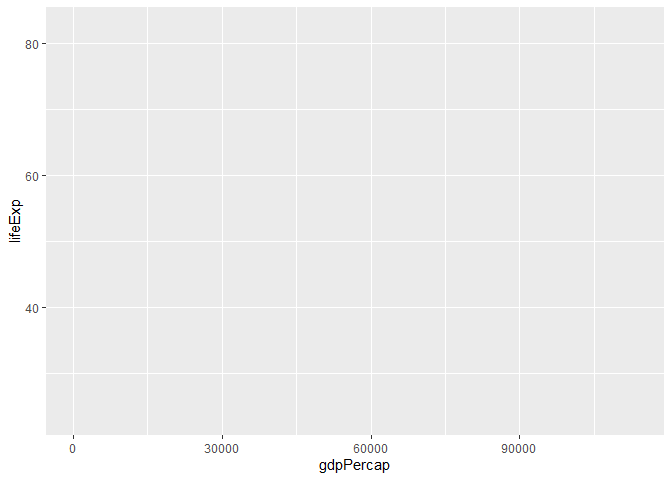<!-- -->
Now we have the axes information. But because we did not tell the type of graph we want the graph is still empty. Let's say we want a scatter plot: 

```r
ggplot(data = gapminder, mapping = aes(x = gdpPercap, y = lifeExp)) +
  geom_point()
```

<!-- -->
This is accomplished by adding `geom_point()` using the `+` after `ggplot()`. 


The same graph can also be produced using: 

```r
ggplot(data = gapminder) +
  geom_point(mapping = aes(x = gdpPercap, y = lifeExp))
```

<!-- -->


## Line graph

Example: Draw a time series graph for Turkish per capita GDP:

```r
library(gapminder)
# create a new table
turkey <- gapminder %>% filter(country=="Turkey")
# plot
ggplot(turkey, aes(x = year, y = gdpPercap)) +
  geom_line()  
```

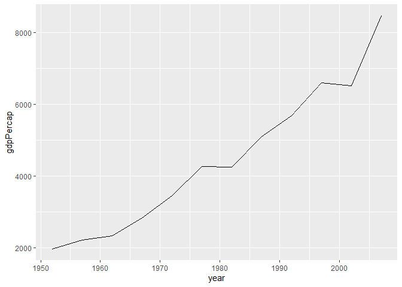<!-- -->

Add points, add labels to x and y axes, and a title:  

```r
library(gapminder)
turkey <- gapminder %>% filter(country=="Turkey")
ggplot(turkey, aes(x = year, y = gdpPercap)) +
  geom_line() +
  geom_point() +
  xlab("") +
  ylab("GDP per capita") +
  ggtitle("Turkey")
```

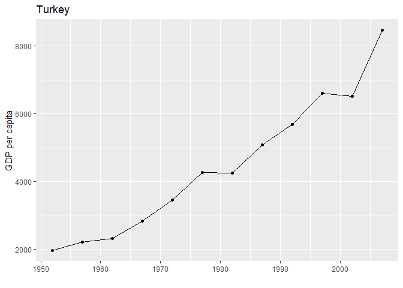<!-- -->


Example: For low-income European countries draw a time series graph of life expectancy. If gdpPercap<10000 in 2007 then low-income, otherwise high-income 

```r
# create the data set
europe <- gapminder %>% 
  filter(continent == "Europe") 
clist <- filter(europe, gdpPercap<10000 & year==2007)
lowincome_europe <- filter(europe, country %in% clist$country)
# plot 
ggplot(lowincome_europe, aes(x = year, y = lifeExp, color = country)) +
  geom_line()
```

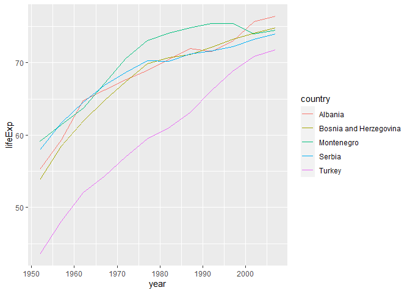<!-- -->

The same graph in black-white

```r
ggplot(lowincome_europe, aes(x = year, y = lifeExp, linetype = country)) +
  geom_line() + 
  theme_bw() + 
  scale_x_continuous(breaks=seq(1952,2007,5)) + 
  theme(axis.text.x = element_text(angle = 90, vjust = 0.5, hjust = 1)) +
  xlab("")
```

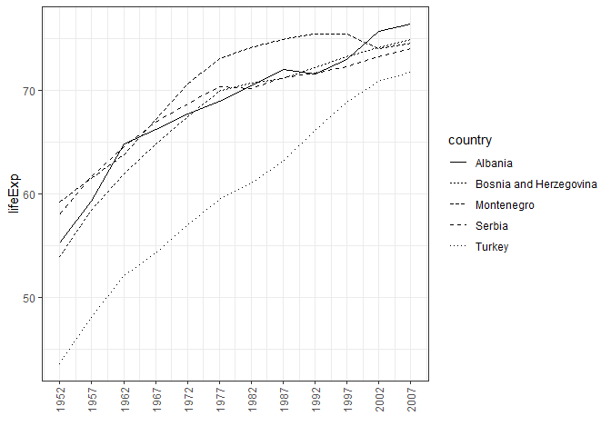<!-- -->


## Histogram

Histogram is useful in visualizing how a continuous variable is distributed. We use  `geom_histogram()` for this. Fro example: 


```r
y2007 <- filter(gapminder, year==2007)
ggplot(data = y2007 ) +
geom_histogram(mapping = aes(x = lifeExp))
```

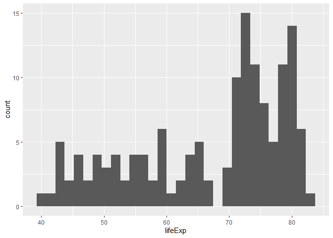<!-- -->

The most important choice in histogram is the number of bins. Users should select the appropriate number of bins instead of relying on default values. Redraw the histogram with bins=15

```r
ggplot(data = y2007 ) +
  geom_histogram(mapping = aes(x = lifeExp), bins = 15)
```

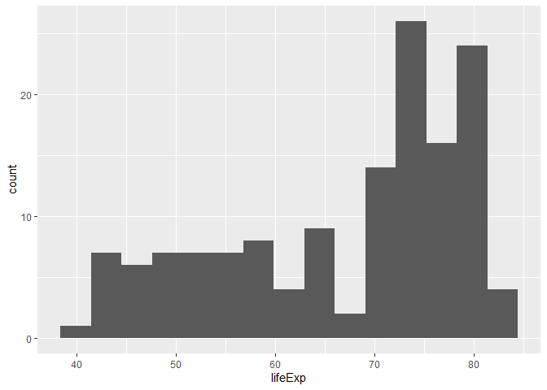<!-- -->
We see that life expectancy is bimodal in 2007.  

Example: Draw the histogram using all years: 

```r
library(gapminder)
ggplot(data =gapminder ) +
  geom_histogram(mapping = aes(x = lifeExp), binwidth = 0.5)
```

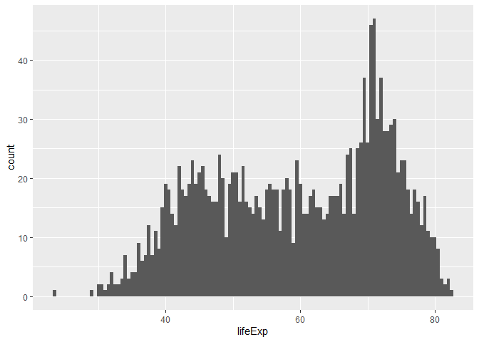<!-- -->


Example: A simulated data set: 

```r
set.seed(1)
n <- 200
grades1 <- rnorm(n, mean = 50, sd = 10)
grades2 <- rnorm(n, mean = 60, sd = 15)
grades3 <- rnorm(n, mean = 70, sd = 12)
class <-  factor( rep(c("Econometrics-1","Econometrics-2","Machine-Learning"), each=n) )
gradedata <- data.frame(class, grades = c(grades1, grades2, grades3))
gradedata <- filter(gradedata, grades<=100 & grades>=0)
head(gradedata)
```

```
##            class   grades
## 1 Econometrics-1 43.73546
## 2 Econometrics-1 51.83643
## 3 Econometrics-1 41.64371
## 4 Econometrics-1 65.95281
## 5 Econometrics-1 53.29508
## 6 Econometrics-1 41.79532
```


```r
ggplot(data = gradedata) +
  geom_histogram(mapping = aes(x = grades)) +
  facet_wrap(~ class)
```

<!-- -->

## Box Plot 


```r
ggplot(data = gradedata) +
  geom_boxplot(mapping = aes(x = class, y=grades))  
```

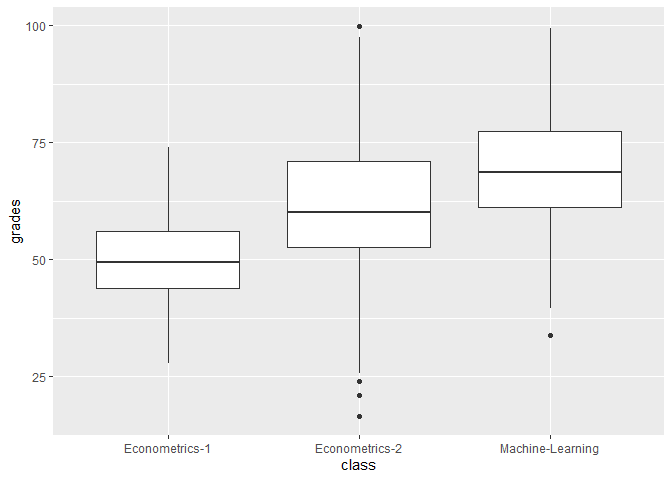<!-- -->

**Example:** Draw box plots of life expectancy according to continents 
over continents


```r
ggplot(data = gapminder, mapping = aes(x = continent, y = lifeExp)) + 
  geom_boxplot()
```

<!-- -->


## Dot plot

When we have a categorical variable and a continuous variable dot plot may be useful.

Example: Draw a dot plot of life expectancy in Europe in 2007 in descending order. 

```r
# create data set
europe2007 <- gapminder %>% 
  filter(year == 2007, continent == "Europe") 
# plot
ggplot(europe2007, aes(x = lifeExp, y = fct_reorder(country, lifeExp))) +
  geom_point()
```

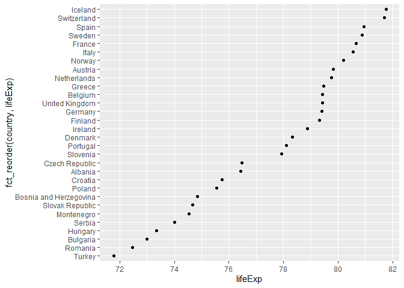<!-- -->

## Scatter plots 

**Example**: GDP per capita and life expectancy in Gapminder: 

```r
library(gapminder)
ggplot(gapminder, aes(x=log(gdpPercap),y=lifeExp)) +
      geom_point()
```

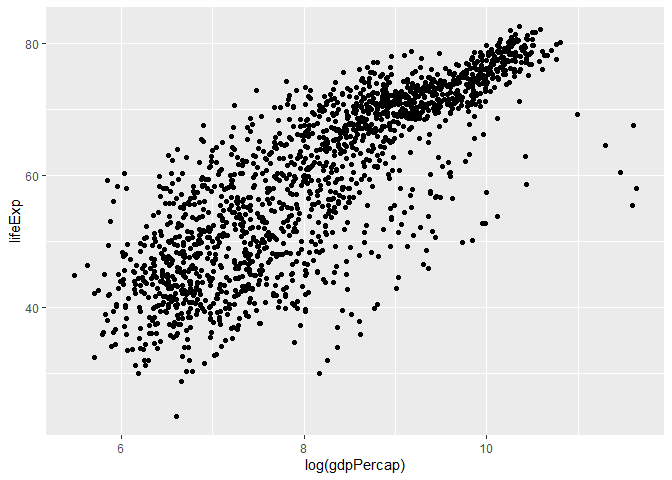<!-- -->

**Example**: Using color aesthetics, add continent information: 

```r
splot1 <- ggplot(gapminder, aes(x=log(gdpPercap),y=lifeExp)) +
             geom_point(aes(color=continent))
splot1
```

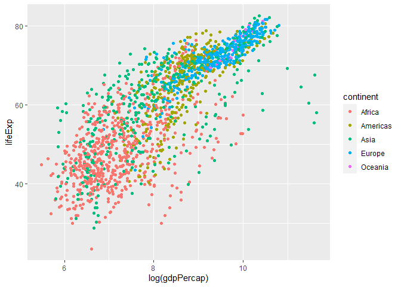<!-- -->

**Example**: Make it black and white using themes:  

```r
ggplot(gapminder, aes(x=log(gdpPercap),y=lifeExp)) +
      geom_point(aes(color=continent)) +
      theme_bw()
```

<!-- -->

or, more conveniently, 

```r
splot1 + theme_bw()
```

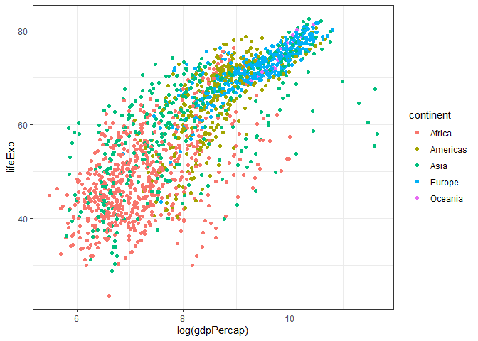<!-- -->


**Exercise**: Draw the previous graph for 2002 only. 


**Example**: Creating subgraphs (**facets**).

```r
ggplot(gapminder, aes(x=log(gdpPercap),y=lifeExp)) +
      geom_point() +
      facet_wrap(~ continent, nrow=2)
```

<!-- -->


**Example**:  Using year as facet: 

```r
ggplot(gapminder, aes(x=log(gdpPercap),y=lifeExp)) +
      geom_point(aes(color=continent)) +
      facet_wrap(~ year, nrow=2)
```

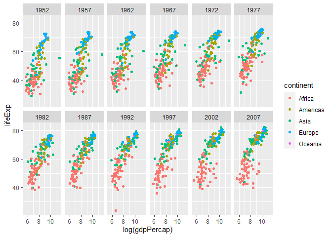<!-- -->

**Example**: Use other geoms as layers: 

```r
ggplot(gapminder, aes(x=log(gdpPercap),y=lifeExp)) +
      geom_point(aes(color=continent)) +
      geom_smooth() +
      theme_bw()
```

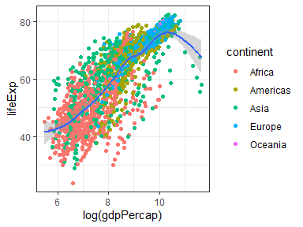<!-- -->


**Example**: Adding smoothed line 

```r
ggplot(gapminder, aes(x=log(gdpPercap),y=lifeExp)) +
      geom_point(aes(color=continent)) +
      geom_smooth(data = filter(gapminder, continent == "Europe"), se=FALSE) +
      theme_bw()
```

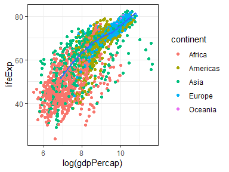<!-- -->

# Application: Life indicators in Turkey by provinces (2015)

Import the data set using `readxl::read_excel()` function: 

```r
library(tidyverse)
library(readxl) 
lifedata <- read_excel("../Data/tuik-life-data-2015.xls", range = "A6:BA88")
```

Inspecting the data set using `View(lifedata)` we see that some of the rows and columns are empty, `NA`. Other than that, the data set is in tidy form.  


Erase the empty columns: 

```r
# erase columns starting with "..."  
lifedata <- lifedata %>% 
  dplyr::select(-contains('...'))
# note: select() may not work right if MASS is package is also loaded
```

Erase the first row: 

```r
lifedata <- lifedata %>% drop_na()
```
Now we have a data set containing 42 variables on 81 provinces. But variable names are too long. Let's change them. 


```r
# TR renaming
# create a character vector containing existing variable names 
isim_tanim <- names(lifedata)
```

We will keep this to see the full name and explanation of the variables. For example variable 42's definition can be accessed using: 

```r
isim_tanim[42]
```

```
## [1] "Mutluluk düzeyi \n(%) \nLevel of happiness \n(%)"
```
But here is shorter variable names that are easier to use: 

```r
# chanage the elements of the character vector 
# here I use Turkish names
isimler <- isim_tanim
isimler[1] <- "il"
isimler[2] <- "oda"
isimler[3] <- "tuv"
isimler[4] <- "ev_kalite"
isimler[5] <- "istihdam"
isimler[6] <- "issizlik"
isimler[7] <- "ort_gun_kazanc"
isimler[8] <- "is_tatmin"
isimler[9] <- "tasarruf"
isimler[10] <- "orta_ust_gelir_gr"
isimler[11] <- "temel_iht_gr"
isimler[12] <- "bebek_mort"
isimler[13] <- "yasam_bek"
isimler[14] <- "doktor_basv"
isimler[15] <- "saglik_tatmin"
isimler[16] <- "kamu_saglik_tatmin"
isimler[17] <- "okullasma_3_5"
isimler[18] <- "TEOG"
isimler[19] <- "YGS"
isimler[20] <- "yuk_egit_orani"
isimler[21] <- "kamu_egit_tatmin"
isimler[22] <- "hava_kir"
isimler[23] <- "orman_alan"
isimler[24] <- "atik_hiz"
isimler[25] <- "gurultu_kir"
isimler[26] <- "bel_temiz_tatmin"
isimler[27] <- "cinayet"
isimler[28] <- "tra_kaza"
isimler[29] <- "gece_guv_yuru"
isimler[30] <- "kamu_guv_tatmin"
isimler[31] <- "oy_verme_belediye"
isimler[32] <- "uyelik_siy_parti"
isimler[33] <- "sendika"
isimler[34] <- "internet"
isimler[35] <- "kanalizasyon"
isimler[36] <- "havaalani"
isimler[37] <- "kamu_ulasim_tatmin"
isimler[38] <- "sin_tiyatro"
isimler[39] <- "avm"
isimler[40] <- "sosyal_ilis_tatmin"
isimler[41] <- "sosyal_hayat_tatmin"
isimler[42] <- "mutluluk"
```

Change column names: 

```r
colnames(lifedata) <- isimler
# print 
glimpse(lifedata)
```

```
## Rows: 81
## Columns: 42
## $ il                  <chr> "Adana", "Adıyaman", "Afyonkarahisar", "Ağrı", ...
## $ oda                 <dbl> 1.22, 0.93, 1.36, 0.84, 1.40, 1.57, 1.38, 1.62,...
## $ tuv                 <dbl> 86.34, 77.07, 90.20, 64.06, 95.03, 98.68, 96.65...
## $ ev_kalite           <dbl> 22.7300, 41.1200, 12.9475, 40.4750, 16.8550, 15...
## $ istihdam            <dbl> 43.3, 39.2, 51.1, 53.2, 47.4, 44.5, 52.9, 47.1,...
## $ issizlik            <dbl> 13.2, 9.1, 5.6, 6.8, 6.6, 10.2, 7.9, 7.1, 6.9, ...
## $ ort_gun_kazanc      <dbl> 59.06489, 53.24281, 53.91157, 56.10804, 53.7736...
## $ is_tatmin           <dbl> 73.32, 64.26, 85.34, 63.97, 88.73, 78.86, 78.62...
## $ tasarruf            <dbl> 5427.7249, 1542.6665, 4062.0552, 842.0468, 3120...
## $ orta_ust_gelir_gr   <dbl> 34.06, 16.27, 29.73, 22.56, 34.79, 58.91, 45.53...
## $ temel_iht_gr        <dbl> 59.77, 74.77, 44.08, 73.54, 43.75, 42.38, 48.66...
## $ bebek_mort          <dbl> 13.181440, 12.061484, 9.572374, 14.432990, 15.3...
## $ yasam_bek           <dbl> 77.39335, 79.54820, 76.99212, 75.62830, 77.7671...
## $ doktor_basv         <dbl> 5323.230, 7437.147, 5727.391, 6719.994, 8067.41...
## $ saglik_tatmin       <dbl> 68.47, 69.13, 80.07, 66.20, 74.16, 71.76, 68.45...
## $ kamu_saglik_tatmin  <dbl> 72.47, 74.62, 87.33, 63.31, 86.51, 68.11, 68.74...
## $ okullasma_3_5       <dbl> 28.42111, 29.97829, 31.80432, 25.43312, 47.1329...
## $ TEOG                <dbl> 281.8823, 289.2975, 295.5051, 233.6633, 317.395...
## $ YGS                 <dbl> 200.4603, 197.0776, 195.4770, 189.9064, 195.541...
## $ yuk_egit_orani      <dbl> 14.213525, 12.288690, 10.780795, 8.618258, 13.4...
## $ kamu_egit_tatmin    <dbl> 63.85, 69.01, 88.89, 65.27, 87.53, 57.97, 62.24...
## $ hava_kir            <dbl> 44.750, 71.000, 81.000, 47.000, 29.000, 63.375,...
## $ orman_alan          <dbl> 42.0942647, 25.2342919, 17.0007135, 0.5320299, ...
## $ atik_hiz            <dbl> 97.93920, 65.94185, 73.07243, 56.18963, 69.9894...
## $ gurultu_kir         <dbl> 25.53, 19.39, 6.48, 12.92, 12.83, 26.98, 28.65,...
## $ bel_temiz_tatmin    <dbl> 59.64, 36.68, 77.61, 35.94, 74.43, 73.87, 73.01...
## $ cinayet             <dbl> 42.944318, 18.399726, 29.729420, 29.120824, 21....
## $ tra_kaza            <dbl> 2.262196, 1.763028, 2.815801, 1.301337, 3.08157...
## $ gece_guv_yuru       <dbl> 53.11, 73.59, 87.23, 57.88, 67.49, 51.06, 52.54...
## $ kamu_guv_tatmin     <dbl> 76.61, 82.75, 91.15, 76.91, 92.29, 71.55, 75.97...
## $ oy_verme_belediye   <dbl> 88.1, 87.2, 92.0, 77.1, 91.2, 90.9, 89.8, 87.7,...
## $ uyelik_siy_parti    <dbl> 20.61238, 22.28865, 19.95792, 18.63778, 22.1014...
## $ sendika             <dbl> 7.60, 6.98, 5.71, 6.36, 5.42, 8.15, 6.75, 12.32...
## $ internet            <dbl> 9.737647, 3.714905, 7.035255, 2.163495, 8.61009...
## $ kanalizasyon        <dbl> 91.50000, 67.71592, 71.86776, 50.36374, 68.9905...
## $ havaalani           <dbl> 7449.761905, 74.326923, 11.969440, 167.023810, ...
## $ kamu_ulasim_tatmin  <dbl> 56.34, 36.72, 74.24, 48.54, 73.36, 62.19, 54.20...
## $ sin_tiyatro         <dbl> 73.090444, 2.903811, 34.917628, 6.321949, 19.25...
## $ avm                 <dbl> 82.44524, 0.00000, 119.90866, 0.00000, 0.00000,...
## $ sosyal_ilis_tatmin  <dbl> 81.90, 81.82, 94.04, 90.04, 92.76, 81.05, 78.23...
## $ sosyal_hayat_tatmin <dbl> 46.74, 56.88, 70.29, 46.16, 62.71, 51.25, 50.45...
## $ mutluluk            <dbl> 53.00, 65.01, 76.43, 60.09, 66.02, 56.23, 49.79...
```


```r
library(corrplot)
corrplot(cor(lifedata[-1]), is.corr=TRUE, order = "FPC")
```

<!-- -->

Save the data in  `RData` format:  

```r
save(lifedata, file = "../Data/life-data-2015.RData")
```
 


Summary statistics on Mutluluk and histogram:  

```r
summary(lifedata$mutluluk)
```

```
##    Min. 1st Qu.  Median    Mean 3rd Qu.    Max. 
##   41.98   56.54   60.39   61.15   65.57   77.66
```

```r
lifedata %>% ggplot(mapping = aes(x = mutluluk)) +
  geom_histogram(bins = 6)
```

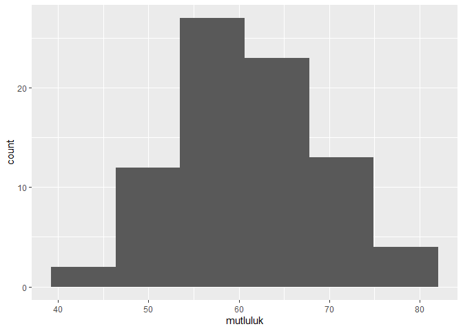<!-- -->

Which provinces are the happiest? 

```r
# list top 10 happiest provinces
lifedata %>% 
  select(il, mutluluk)  %>% 
  arrange(desc(mutluluk)) %>% 
  head(10) 
```

```
## # A tibble: 10 x 2
##    il             mutluluk
##    <chr>             <dbl>
##  1 Sinop              77.7
##  2 Afyonkarahisar     76.4
##  3 Bayburt            75.9
##  4 Kırıkkale          75.5
##  5 Kütahya            73.8
##  6 Çankırı            73.5
##  7 Düzce              72.8
##  8 Uşak               72.3
##  9 Siirt              71.6
## 10 Şırnak             71.4
```

All provinces in a dot plot:  

```r
ggplot(lifedata, aes(x = mutluluk, y = fct_reorder(il, mutluluk))) +
  geom_point()
```

<!-- -->

Interpret the following two graphs


```r
# Ortalama günlük kazanç (TL) vs. Mutluluk
ggplot(lifedata, aes(x=ort_gun_kazanc, y=mutluluk)) +
      geom_point()
```

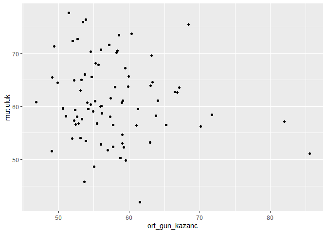<!-- -->


```r
# Orta ve üstü gelir grubundaki hanelerin oranı (%) vs Mutluluk
ggplot(lifedata, aes(x=orta_ust_gelir_gr, y=mutluluk)) +
      geom_point()
```

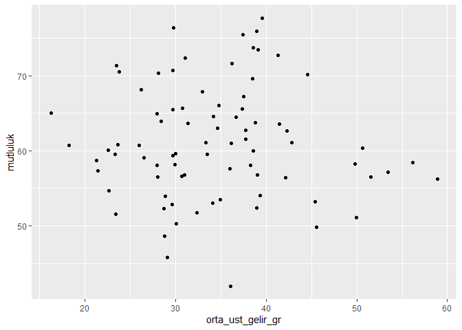<!-- -->

# Application: Province populations in Turkey 

## Prepare the Data

I downloaded two data sets from the TUIK website. The first one contains province (city) level population growth rates and density: 

```r
library(tidyverse)
library(readxl)
# population density and growth in the same xlx file
pop_dens_growth <- read_excel("../Data/nufus_artis_yog_il.xls", range = "A4:Z86")
# view(pop_dens_growth)
# Note that this data set contains both growth rates and population density
```

We need to separate the two variables in `pop_dens_growth`. Let's start with population density: 

```r
popdensity <- pop_dens_growth[, c(1,14:26)]
popdensity %>% head(5)
```

```
## # A tibble: 5 x 14
##   ...1  `2007` `2008` `2009` `2010` `2011` `2012` `2013` `2014` `2015` `2016`
##   <chr>  <dbl>  <dbl>  <dbl>  <dbl>  <dbl>  <dbl>  <dbl>  <dbl>  <dbl>  <dbl>
## 1 Topl~   91.7   92.9   94.3   95.8   97.1   98.3   99.6  101.   102.   104. 
## 2 Adana  144.   146.   148.   150.   152.   153.   154.   156.   157.   158. 
## 3 Adıy~   82.9   83.2   83.7   84.0   84.4   84.6   84.9   85.0   85.7   86.8
## 4 Afyo~   49.0   48.7   49.0   48.7   48.8   49.2   49.4   49.3   49.5   49.9
## 5 Ağrı    46.3   46.4   46.9   47.3   48.4   48.2   48.1   47.9   47.7   47.3
## # ... with 3 more variables: `2017` <dbl>, `2018` <dbl>, `2019` <dbl>
```

The first row contains overall density over the years. 

```r
travr_popdensity <- popdensity[1,]
nr <- dim(popdensity)[1]
nc <- dim(popdensity)[2]
popdensity <- popdensity[2:nr,]
popdensity <- rename(popdensity, "province"="...1")
popdensity %>% head(5)
```

```
## # A tibble: 5 x 14
##   province `2007` `2008` `2009` `2010` `2011` `2012` `2013` `2014` `2015` `2016`
##   <chr>     <dbl>  <dbl>  <dbl>  <dbl>  <dbl>  <dbl>  <dbl>  <dbl>  <dbl>  <dbl>
## 1 Adana     144.   146.   148.   150.   152.   153.   154.   156.   157.   158. 
## 2 Adıyaman   82.9   83.2   83.7   84.0   84.4   84.6   84.9   85.0   85.7   86.8
## 3 Afyonka~   49.0   48.7   49.0   48.7   48.8   49.2   49.4   49.3   49.5   49.9
## 4 Ağrı       46.3   46.4   46.9   47.3   48.4   48.2   48.1   47.9   47.7   47.3
## 5 Amasya     57.8   56.9   57.0   58.8   56.8   56.6   56.6   56.6   56.6   57.4
## # ... with 3 more variables: `2017` <dbl>, `2018` <dbl>, `2019` <dbl>
```

Convert to long form:  

```r
popdens <- popdensity %>% 
  pivot_longer(-province, names_to="year", values_to = "density") 
popdens %>% arrange(year,province) %>% head(5)
```

```
## # A tibble: 5 x 3
##   province       year  density
##   <chr>          <chr>   <dbl>
## 1 Adana          2007    144. 
## 2 Adıyaman       2007     82.9
## 3 Afyonkarahisar 2007     49.0
## 4 Ağrı           2007     46.3
## 5 Aksaray        2007     48.4
```

Now do the same for the growth rate. 

```r
popgrowth <- pop_dens_growth[,c(1:13)]
popgrowth %>% head(5)
```

```
## # A tibble: 5 x 13
##   ...1  `2007-2008` `2008-2009` `2009-2010` `2010-2011` `2011-2012` `2012-2013`
##   <chr>       <dbl>       <dbl>       <dbl>       <dbl>       <dbl>       <dbl>
## 1 Topl~       13.1        14.5        15.9        13.5        12.0        13.7 
## 2 Adana        9.82       17.6        11.1        11.2         7.95       11.1 
## 3 Adıy~        3.95        5.81        4.17        5.06        2.24        3.23
## 4 Afyo~       -6.01        5.66       -5.39        1.53        7.59        4.50
## 5 Ağrı         2.45       10.3         8.07       24.5        -5.55       -2.22
## # ... with 6 more variables: `2013-2014` <dbl>, `2014-2015` <dbl>,
## #   `2015-2016` <dbl>, `2016-2017` <dbl>, `2017-2018` <dbl>, `2018-2019` <dbl>
```


```r
travr_popgrowth <- popgrowth[1,]
popgrowth <- popgrowth[2:nr,]
# rename the first column 
popgrowth <- rename(popgrowth, "province"="...1")
popgrowth %>% head(5)
```

```
## # A tibble: 5 x 13
##   province `2007-2008` `2008-2009` `2009-2010` `2010-2011` `2011-2012`
##   <chr>          <dbl>       <dbl>       <dbl>       <dbl>       <dbl>
## 1 Adana           9.82       17.6        11.1        11.2         7.95
## 2 Adıyaman        3.95        5.81        4.17        5.06        2.24
## 3 Afyonka~       -6.01        5.66       -5.39        1.53        7.59
## 4 Ağrı            2.45       10.3         8.07       24.5        -5.55
## 5 Amasya        -16.3         1.83       31.9       -35.6        -2.47
## # ... with 7 more variables: `2012-2013` <dbl>, `2013-2014` <dbl>,
## #   `2014-2015` <dbl>, `2015-2016` <dbl>, `2016-2017` <dbl>, `2017-2018` <dbl>,
## #   `2018-2019` <dbl>
```

Columns are the growth rates over the specified period. We need to convert them to single numbers. 

```r
years20072019 <- colnames(popdensity)[-1]
years20082019 <- years20072019[-1]
oldnames <- colnames(popgrowth)[-1]
# rename the rest of the cols
popgrowth <- popgrowth %>% 
  rename_at(vars(oldnames), ~ years20082019)
popgrowth %>% head(5)
```

```
## # A tibble: 5 x 13
##   province `2008` `2009` `2010` `2011` `2012` `2013` `2014` `2015` `2016` `2017`
##   <chr>     <dbl>  <dbl>  <dbl>  <dbl>  <dbl>  <dbl>  <dbl>  <dbl>  <dbl>  <dbl>
## 1 Adana      9.82  17.6   11.1   11.2    7.95 11.1    7.57   8.08    8.44   6.70
## 2 Adıyaman   3.95   5.81   4.17   5.06   2.24  3.23   1.09   8.23   12.7    7.49
## 3 Afyonka~  -6.01   5.66  -5.39   1.53   7.59  4.50  -1.06   3.74    7.74   1.64
## 4 Ağrı       2.45  10.3    8.07  24.5   -5.55 -2.22  -3.17  -4.06   -9.10 -11.1 
## 5 Amasya   -16.3    1.83  31.9  -35.6   -2.47 -0.950 -0.199  0.789  12.9   10.8 
## # ... with 2 more variables: `2018` <dbl>, `2019` <dbl>
```

Now we are ready to convert it to long form. 

```r
# convert to long form 
popgr <- popgrowth %>% 
  pivot_longer(-province, names_to="year", values_to = "growth")
popgr %>% arrange(year, province) %>% head(5)
```

```
## # A tibble: 5 x 3
##   province       year  growth
##   <chr>          <chr>  <dbl>
## 1 Adana          2008    9.82
## 2 Adıyaman       2008    3.95
## 3 Afyonkarahisar 2008   -6.01
## 4 Ağrı           2008    2.45
## 5 Aksaray        2008   12.2
```


The second data set contains city populations. 

```r
# population data
city_pop <- read_excel("../Data/nufus_il2019.xls", range = "A4:U86")
city_pop %>% head(5)
```

```
## # A tibble: 5 x 21
##   ...1  `2000` `2001` `2002` `2003` `2004` `2005` `2006` `2007` `2008` `2009`
##   <chr>  <dbl>  <dbl>  <dbl>  <dbl>  <dbl>  <dbl>  <dbl>  <dbl>  <dbl>  <dbl>
## 1 Topl~ 6.47e7 6.56e7 6.64e7 6.72e7 6.80e7 6.89e7 6.97e7 7.06e7 7.15e7 7.26e7
## 2 Adana 1.88e6 1.90e6 1.92e6 1.93e6 1.95e6 1.97e6 1.99e6 2.01e6 2.03e6 2.06e6
## 3 Adıy~ 5.68e5 5.71e5 5.73e5 5.75e5 5.77e5 5.79e5 5.81e5 5.83e5 5.85e5 5.88e5
## 4 Afyo~ 6.96e5 6.98e5 6.99e5 6.99e5 7.00e5 7.01e5 7.01e5 7.02e5 6.97e5 7.01e5
## 5 Ağrı  5.19e5 5.22e5 5.23e5 5.25e5 5.26e5 5.28e5 5.29e5 5.31e5 5.32e5 5.38e5
## # ... with 10 more variables: `2010` <dbl>, `2011` <dbl>, `2012` <dbl>,
## #   `2013` <dbl>, `2014` <dbl>, `2015` <dbl>, `2016` <dbl>, `2017` <dbl>,
## #   `2018` <dbl>, `2019` <dbl>
```


```r
# first row is TR total population
trpop_overall <- city_pop[1,] 
trpop_province <- city_pop[-1,]
# rename the first column 
trpop_province <- rename(trpop_province, "province"="...1")
trpop_province %>% head(5)
```

```
## # A tibble: 5 x 21
##   province `2000` `2001` `2002` `2003` `2004` `2005` `2006` `2007` `2008` `2009`
##   <chr>     <dbl>  <dbl>  <dbl>  <dbl>  <dbl>  <dbl>  <dbl>  <dbl>  <dbl>  <dbl>
## 1 Adana    1.88e6 1.90e6 1.92e6 1.93e6 1.95e6 1.97e6 1.99e6 2.01e6 2.03e6 2.06e6
## 2 Adıyaman 5.68e5 5.71e5 5.73e5 5.75e5 5.77e5 5.79e5 5.81e5 5.83e5 5.85e5 5.88e5
## 3 Afyonka~ 6.96e5 6.98e5 6.99e5 6.99e5 7.00e5 7.01e5 7.01e5 7.02e5 6.97e5 7.01e5
## 4 Ağrı     5.19e5 5.22e5 5.23e5 5.25e5 5.26e5 5.28e5 5.29e5 5.31e5 5.32e5 5.38e5
## 5 Amasya   3.34e5 3.34e5 3.33e5 3.32e5 3.31e5 3.31e5 3.30e5 3.29e5 3.24e5 3.24e5
## # ... with 10 more variables: `2010` <dbl>, `2011` <dbl>, `2012` <dbl>,
## #   `2013` <dbl>, `2014` <dbl>, `2015` <dbl>, `2016` <dbl>, `2017` <dbl>,
## #   `2018` <dbl>, `2019` <dbl>
```


```r
# wide to long
population <- trpop_province %>% 
  pivot_longer(-province, names_to="year", values_to = "population")
population %>% arrange(year, province) %>% head(5)
```

```
## # A tibble: 5 x 3
##   province       year  population
##   <chr>          <chr>      <dbl>
## 1 Adana          2000     1879695
## 2 Adıyaman       2000      568432
## 3 Afyonkarahisar 2000      696292
## 4 Ağrı           2000      519190
## 5 Aksaray        2000      351474
```

We have three data sets in long form: `population`, `popgr`, and `popdens`. 
Combine all in a single tibble

```r
# join them in a tibble
# Joining, by = c("province", "year")
trpopinfo <- full_join(popdens, popgr)
trpopinfo <- full_join(population, trpopinfo)
trpopinfo %>% head(20)
```

```
## # A tibble: 20 x 5
##    province year  population density growth
##    <chr>    <chr>      <dbl>   <dbl>  <dbl>
##  1 Adana    2000     1879695     NA   NA   
##  2 Adana    2001     1899324     NA   NA   
##  3 Adana    2002     1916637     NA   NA   
##  4 Adana    2003     1933428     NA   NA   
##  5 Adana    2004     1951142     NA   NA   
##  6 Adana    2005     1969512     NA   NA   
##  7 Adana    2006     1988277     NA   NA   
##  8 Adana    2007     2006650    144.  NA   
##  9 Adana    2008     2026319    146.   9.82
## 10 Adana    2009     2062226    148.  17.6 
## 11 Adana    2010     2085225    150.  11.1 
## 12 Adana    2011     2108805    152.  11.2 
## 13 Adana    2012     2125635    153.   7.95
## 14 Adana    2013     2149260    154.  11.1 
## 15 Adana    2014     2165595    156.   7.57
## 16 Adana    2015     2183167    157.   8.08
## 17 Adana    2016     2201670    158.   8.44
## 18 Adana    2017     2216475    159.   6.70
## 19 Adana    2018     2220125    160.   1.65
## 20 Adana    2019     2237940    161.   7.99
```

**TASK**: Create a new variable using the formula `area = population/density`. City area must be a constant over years. 

```r
# create a new variable for the area 
trpopinfo <- trpopinfo %>% group_by(year) %>% 
  mutate(area=population/density)
trpopinfo %>% head(20)
```

```
## # A tibble: 20 x 6
## # Groups:   year [20]
##    province year  population density growth   area
##    <chr>    <chr>      <dbl>   <dbl>  <dbl>  <dbl>
##  1 Adana    2000     1879695     NA   NA       NA 
##  2 Adana    2001     1899324     NA   NA       NA 
##  3 Adana    2002     1916637     NA   NA       NA 
##  4 Adana    2003     1933428     NA   NA       NA 
##  5 Adana    2004     1951142     NA   NA       NA 
##  6 Adana    2005     1969512     NA   NA       NA 
##  7 Adana    2006     1988277     NA   NA       NA 
##  8 Adana    2007     2006650    144.  NA    13915 
##  9 Adana    2008     2026319    146.   9.82 13915 
## 10 Adana    2009     2062226    148.  17.6  13915 
## 11 Adana    2010     2085225    150.  11.1  13915 
## 12 Adana    2011     2108805    152.  11.2  13915 
## 13 Adana    2012     2125635    153.   7.95 13915 
## 14 Adana    2013     2149260    154.  11.1  13915.
## 15 Adana    2014     2165595    156.   7.57 13915 
## 16 Adana    2015     2183167    157.   8.08 13915.
## 17 Adana    2016     2201670    158.   8.44 13915 
## 18 Adana    2017     2216475    159.   6.70 13915 
## 19 Adana    2018     2220125    160.   1.65 13915 
## 20 Adana    2019     2237940    161.   7.99 13915.
```

Since `density` is missing before 2007, `area` is also missing. 

```r
# cant get rid of year: 
province_area <- trpopinfo %>% 
  filter(year==2007) %>% 
  select(province,year,area) 
province_area %>% head(5)
```

```
## # A tibble: 5 x 3
## # Groups:   year [1]
##   province       year   area
##   <chr>          <chr> <dbl>
## 1 Adana          2007  13915
## 2 Adıyaman       2007   7033
## 3 Afyonkarahisar 2007  14314
## 4 Ağrı           2007  11470
## 5 Amasya         2007   5690
```

Create a cross-sectional data set containing `area` (square km). 

```r
# force a cross section of areas
province_area2 <- tibble(province = province_area$province, 
                         area2 = province_area$area)
province_area2 %>% head(5)
```

```
## # A tibble: 5 x 2
##   province       area2
##   <chr>          <dbl>
## 1 Adana          13915
## 2 Adıyaman        7033
## 3 Afyonkarahisar 14314
## 4 Ağrı           11470
## 5 Amasya          5690
```

Merge the area data set with the population data. 

```r
# merge 
trpop <- left_join(trpopinfo, province_area2)
trpop %>% head(20)
```

```
## # A tibble: 20 x 7
## # Groups:   year [20]
##    province year  population density growth   area area2
##    <chr>    <chr>      <dbl>   <dbl>  <dbl>  <dbl> <dbl>
##  1 Adana    2000     1879695     NA   NA       NA  13915
##  2 Adana    2001     1899324     NA   NA       NA  13915
##  3 Adana    2002     1916637     NA   NA       NA  13915
##  4 Adana    2003     1933428     NA   NA       NA  13915
##  5 Adana    2004     1951142     NA   NA       NA  13915
##  6 Adana    2005     1969512     NA   NA       NA  13915
##  7 Adana    2006     1988277     NA   NA       NA  13915
##  8 Adana    2007     2006650    144.  NA    13915  13915
##  9 Adana    2008     2026319    146.   9.82 13915  13915
## 10 Adana    2009     2062226    148.  17.6  13915  13915
## 11 Adana    2010     2085225    150.  11.1  13915  13915
## 12 Adana    2011     2108805    152.  11.2  13915  13915
## 13 Adana    2012     2125635    153.   7.95 13915  13915
## 14 Adana    2013     2149260    154.  11.1  13915. 13915
## 15 Adana    2014     2165595    156.   7.57 13915  13915
## 16 Adana    2015     2183167    157.   8.08 13915. 13915
## 17 Adana    2016     2201670    158.   8.44 13915  13915
## 18 Adana    2017     2216475    159.   6.70 13915  13915
## 19 Adana    2018     2220125    160.   1.65 13915  13915
## 20 Adana    2019     2237940    161.   7.99 13915. 13915
```

Compute population densities for the missing years: 

```r
# create a new density variable 
trpop <- trpop %>% group_by(province) %>% 
  mutate(density2 = population/area2)
trpop %>% head(20)
```

```
## # A tibble: 20 x 8
## # Groups:   province [1]
##    province year  population density growth   area area2 density2
##    <chr>    <chr>      <dbl>   <dbl>  <dbl>  <dbl> <dbl>    <dbl>
##  1 Adana    2000     1879695     NA   NA       NA  13915     135.
##  2 Adana    2001     1899324     NA   NA       NA  13915     136.
##  3 Adana    2002     1916637     NA   NA       NA  13915     138.
##  4 Adana    2003     1933428     NA   NA       NA  13915     139.
##  5 Adana    2004     1951142     NA   NA       NA  13915     140.
##  6 Adana    2005     1969512     NA   NA       NA  13915     142.
##  7 Adana    2006     1988277     NA   NA       NA  13915     143.
##  8 Adana    2007     2006650    144.  NA    13915  13915     144.
##  9 Adana    2008     2026319    146.   9.82 13915  13915     146.
## 10 Adana    2009     2062226    148.  17.6  13915  13915     148.
## 11 Adana    2010     2085225    150.  11.1  13915  13915     150.
## 12 Adana    2011     2108805    152.  11.2  13915  13915     152.
## 13 Adana    2012     2125635    153.   7.95 13915  13915     153.
## 14 Adana    2013     2149260    154.  11.1  13915. 13915     154.
## 15 Adana    2014     2165595    156.   7.57 13915  13915     156.
## 16 Adana    2015     2183167    157.   8.08 13915. 13915     157.
## 17 Adana    2016     2201670    158.   8.44 13915  13915     158.
## 18 Adana    2017     2216475    159.   6.70 13915  13915     159.
## 19 Adana    2018     2220125    160.   1.65 13915  13915     160.
## 20 Adana    2019     2237940    161.   7.99 13915. 13915     161.
```


```r
# create a new growth variable 
# growth2 is slightly different from TUIK's growth 
# for the period 2008-2019
trpop <- trpop %>% group_by(province) %>% 
  mutate(growth2 = 1000*(population-lag(population))/lag(population))
trpop %>% head(20)
```

```
## # A tibble: 20 x 9
## # Groups:   province [1]
##    province year  population density growth   area area2 density2 growth2
##    <chr>    <chr>      <dbl>   <dbl>  <dbl>  <dbl> <dbl>    <dbl>   <dbl>
##  1 Adana    2000     1879695     NA   NA       NA  13915     135.   NA   
##  2 Adana    2001     1899324     NA   NA       NA  13915     136.   10.4 
##  3 Adana    2002     1916637     NA   NA       NA  13915     138.    9.12
##  4 Adana    2003     1933428     NA   NA       NA  13915     139.    8.76
##  5 Adana    2004     1951142     NA   NA       NA  13915     140.    9.16
##  6 Adana    2005     1969512     NA   NA       NA  13915     142.    9.41
##  7 Adana    2006     1988277     NA   NA       NA  13915     143.    9.53
##  8 Adana    2007     2006650    144.  NA    13915  13915     144.    9.24
##  9 Adana    2008     2026319    146.   9.82 13915  13915     146.    9.80
## 10 Adana    2009     2062226    148.  17.6  13915  13915     148.   17.7 
## 11 Adana    2010     2085225    150.  11.1  13915  13915     150.   11.2 
## 12 Adana    2011     2108805    152.  11.2  13915  13915     152.   11.3 
## 13 Adana    2012     2125635    153.   7.95 13915  13915     153.    7.98
## 14 Adana    2013     2149260    154.  11.1  13915. 13915     154.   11.1 
## 15 Adana    2014     2165595    156.   7.57 13915  13915     156.    7.60
## 16 Adana    2015     2183167    157.   8.08 13915. 13915     157.    8.11
## 17 Adana    2016     2201670    158.   8.44 13915  13915     158.    8.48
## 18 Adana    2017     2216475    159.   6.70 13915  13915     159.    6.72
## 19 Adana    2018     2220125    160.   1.65 13915  13915     160.    1.65
## 20 Adana    2019     2237940    161.   7.99 13915. 13915     161.    8.02
```

## Graphs


```r
# ts plots of density
trpop$year <- as.numeric(trpop$year)
trpop %>% filter(province %in% c("İstanbul","İzmir", "Ankara")) %>% 
  ggplot(aes(x=year,y=density2,color=province)) +
  geom_line()
```

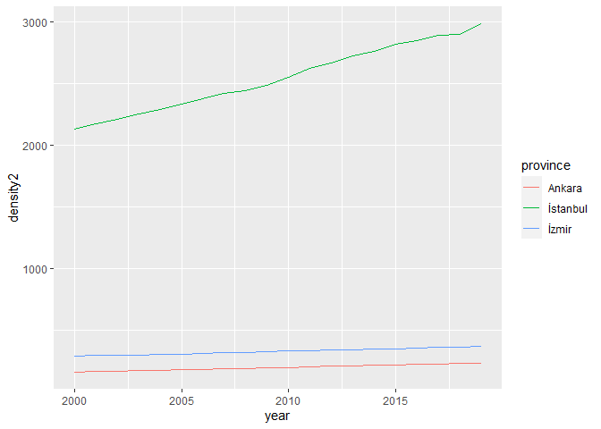<!-- -->


```r
# ts plot of all provinces 
trpop %>%
  ggplot(aes(x=year, y=density2, color=province)) +
  geom_line() +
  theme(legend.position = "none") 
```

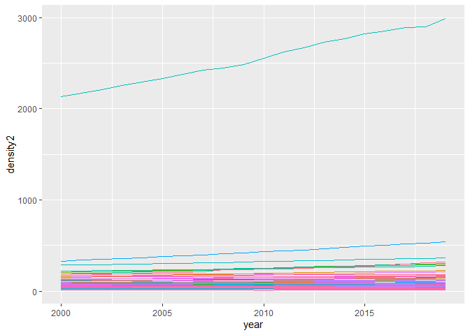<!-- -->


```r
# Draw a line plot for the population growth rate of İstanbul 
trpop %>% filter(province == "İstanbul") %>% 
  ggplot(aes(x=year,y=growth2, color=province)) +
  geom_line()
```

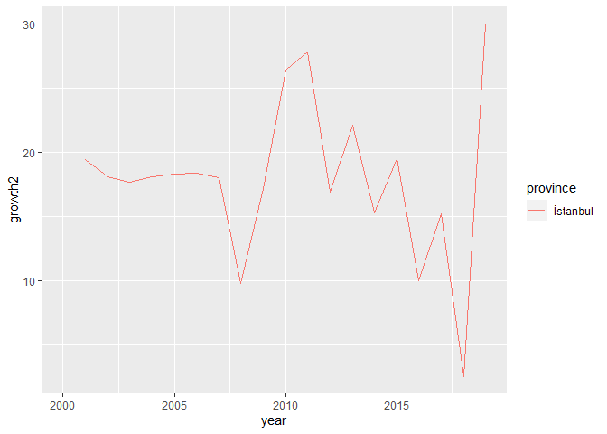<!-- -->


```r
# Do the same for the largest cities
trpop %>% filter(province %in% c("İstanbul","İzmir", "Ankara")) %>% 
  ggplot(aes(x=year, y=growth2, color=province)) +
  geom_line()
```

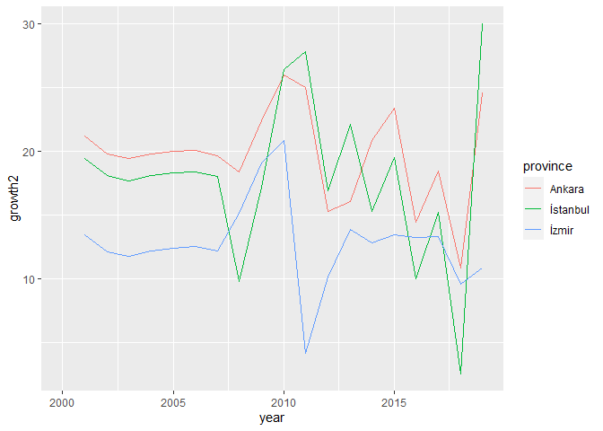<!-- -->


```r
# Find and list provinces having the smallest density in 2019
trpop %>% filter(year==2019) %>% 
  arrange(density2)
```

```
## # A tibble: 81 x 9
## # Groups:   province [81]
##    province   year population density growth  area  area2 density2 growth2
##    <chr>     <dbl>      <dbl>   <dbl>  <dbl> <dbl>  <dbl>    <dbl>   <dbl>
##  1 Tunceli    2019      84660    11.4 -40.9   7432  7432      11.4  -40.1 
##  2 Ardahan    2019      97319    20.1 -16.2   4842  4842      20.1  -16.1 
##  3 Erzincan   2019     234747    20.2  -5.47 11619 11619      20.2   -5.45
##  4 Sivas      2019     638956    22.4 -11.9  28549 28549      22.4  -11.8 
##  5 Bayburt    2019      84843    22.7  30.7   3739  3739.     22.7   31.2 
##  6 Artvin     2019     170875    23.2 -18.2   7367  7367      23.2  -18.0 
##  7 Gümüşhane  2019     164521    25.6  10.8   6437  6437      25.6   10.9 
##  8 Çankırı    2019     195789    26.1 -99.9   7490  7490      26.1  -95.1 
##  9 Kars       2019     285410    28.2 -12.1  10127 10127      28.2  -12.0 
## 10 Karaman    2019     253279    28.6   5.41  8845  8845      28.6    5.42
## # ... with 71 more rows
```


```r
# Draw the histogram of density in 2019
trpop %>% filter(year==2019) %>% 
  ggplot(aes(x=density)) + 
  geom_histogram()
```

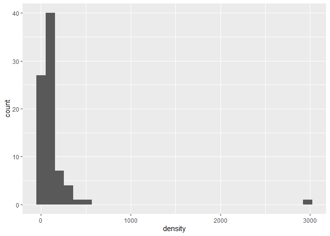<!-- -->


```r
# Find mean and median population density over years
# create a tibble and call it sum_popdens
sum_popdens <- trpop %>% group_by(year) %>% 
  summarize(popdensmean = mean(density2), 
            popdensmedian = median(density2))
# plot
sum_popdens %>% ggplot(aes(x=year, y=popdensmean)) +
  geom_line()
```

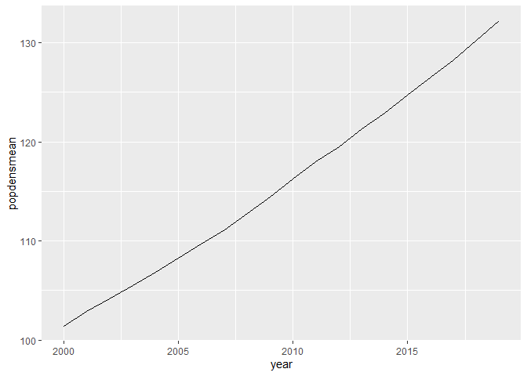<!-- -->

# Application: How popular is your name?

## Read the data set

Turkish Statistical Institute publishes the 100 most popular men and women's names from the address based registration system. I downloaded the data for men's names in  `xls` format and saved it in the Data folder. Upon inspection of the excel file, we see that data is within the range `A6:BA88` including the variable names. We will not alter the original raw data using excel. We will make necessary adjustments using `R`. Let us read it into R: 


```r
library(tidyverse)
library(readxl)
mennames2018 <- read_excel("../Data/erkek_isim_siralama2018.xls", range = "A4:AQ301")
# View(mennames2018) 
```

Note that the first column contains the names and columns are ranks in a given year. 
Also the data is in wide format. Let's do some tidying. 

```r
# rename the first column 
mennames2018 <- rename(mennames2018, "name"="...1")
```


```r
# the data is in wide format 
# convert it to long
mennames <- mennames2018 %>% 
  pivot_longer(-name, names_to="year", values_to = "rank")
```

Check out the data set: 

```r
#
mennames %>% 
  arrange(year, name) %>% 
  head(10)
```

```
## # A tibble: 10 x 3
##    name        year   rank
##    <chr>       <chr> <dbl>
##  1 Abdulkadir  1950     95
##  2 Abdullah    1950     15
##  3 Abdulsamet  1950     NA
##  4 Abdurrahman 1950     46
##  5 Adem        1950     40
##  6 Adil        1950     92
##  7 Adnan       1950     NA
##  8 Ahmet       1950      3
##  9 Ahmet Efe   1950     NA
## 10 Ali         1950      4
```

## Let's answer some questions

1. Find and list the most popular names in 2018. 


```r
# Find and list the most popular 10 names in 2018 
top10_2018 <- mennames %>% 
  filter(year==2018, rank<11) %>% 
  arrange(rank)
top10_2018
```

```
## # A tibble: 10 x 3
##    name      year   rank
##    <chr>     <chr> <dbl>
##  1 Yusuf     2018      1
##  2 Eymen     2018      2
##  3 Ömer Asaf 2018      3
##  4 Miraç     2018      4
##  5 Ömer      2018      5
##  6 Mustafa   2018      6
##  7 Ali Asaf  2018      7
##  8 Ahmet     2018      8
##  9 Emir      2018      9
## 10 Yiğit     2018     10
```

2. Do the same for 2017. Are they the same? 


```r
# 
top10_2017 <- mennames %>% 
  filter(year==2017,rank<11) %>% 
  arrange(rank)
top10_2017
```

```
## # A tibble: 10 x 3
##    name      year   rank
##    <chr>     <chr> <dbl>
##  1 Yusuf     2017      1
##  2 Eymen     2017      2
##  3 Ömer      2017      3
##  4 Emir      2017      4
##  5 Miraç     2017      5
##  6 Mustafa   2017      6
##  7 Ahmet     2017      7
##  8 Ömer Asaf 2017      8
##  9 Berat     2017      9
## 10 Mehmet    2017     10
```

Join the last two years' rankings: 

```r
top10 <- full_join(top10_2017, top10_2018)
top10
```

```
## # A tibble: 20 x 3
##    name      year   rank
##    <chr>     <chr> <dbl>
##  1 Yusuf     2017      1
##  2 Eymen     2017      2
##  3 Ömer      2017      3
##  4 Emir      2017      4
##  5 Miraç     2017      5
##  6 Mustafa   2017      6
##  7 Ahmet     2017      7
##  8 Ömer Asaf 2017      8
##  9 Berat     2017      9
## 10 Mehmet    2017     10
## 11 Yusuf     2018      1
## 12 Eymen     2018      2
## 13 Ömer Asaf 2018      3
## 14 Miraç     2018      4
## 15 Ömer      2018      5
## 16 Mustafa   2018      6
## 17 Ali Asaf  2018      7
## 18 Ahmet     2018      8
## 19 Emir      2018      9
## 20 Yiğit     2018     10
```

3. Plot the ranks of first 10 names (in 2018) together with 2017 using bar plot. 


```r
# graph of 2017 top 10
top10 %>% 
  filter(year==2017) %>%
  mutate(Name = factor(name), Rank = factor(rank)) %>%  
  ggplot(aes(x=reorder(name,-rank), Rank)) +
  geom_bar(position=position_dodge(), stat = "identity") +
  ylab("") +
  coord_flip()
```

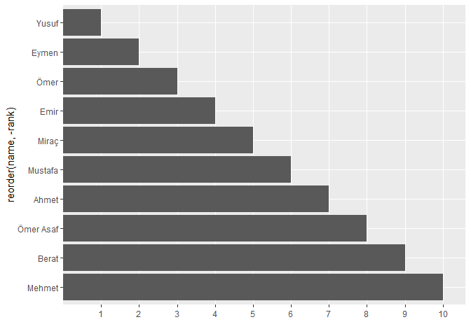<!-- -->

```r
# 
```


```r
# together 
top10 %>%  
  mutate(Name = factor(name), Rank = factor(rank), Year=factor(year)) %>%  
  ggplot(aes(x=reorder(name,-rank), Rank, fill=Year)) +
  geom_bar(position=position_dodge(), stat = "identity") +
  xlab("") +
  coord_flip()
```

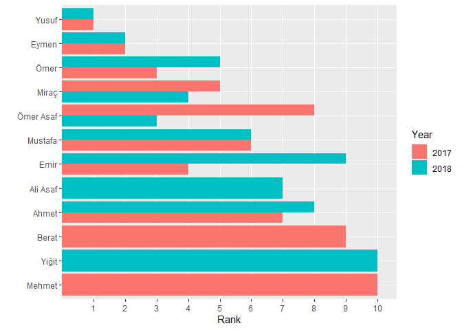<!-- -->

```r
#
```

An alternative is to draw the dot plot. This may be aesthetically more pleasing. 


```r
# dotplot 
top10 %>% 
  mutate(Name = factor(name), Rank = factor(rank), Year=factor(year)) %>%
  ggplot(aes(x=reorder(Name,-rank), Rank, color=Year)) +
  geom_point(position=position_dodge(width = 0.5), stat = "identity") +
  xlab("") +
  coord_flip()
```

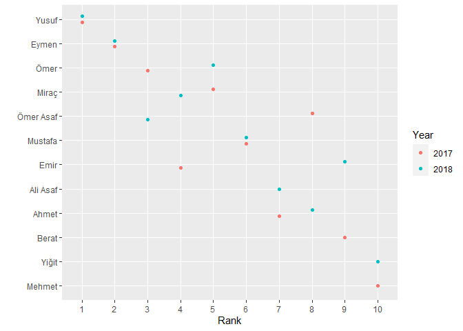<!-- -->


4. Given two names, draw how popular they are over time. 


```r
# Find the popularity of a specific name over time 
thisname <- "Hüseyin"
rank_thisname <- filter(mennames, name==thisname)
plot(rank_thisname$year,100-rank_thisname$rank,type = "l")
```

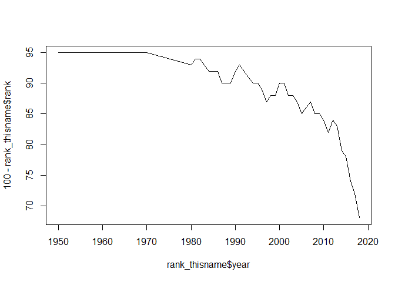<!-- -->

```r
#
# second name 
thisname2 <- "Hasan"
rank_thisname2 <- filter(mennames, name==thisname2)
plot(rank_thisname2$year, 100-rank_thisname2$rank,type = "l")
```

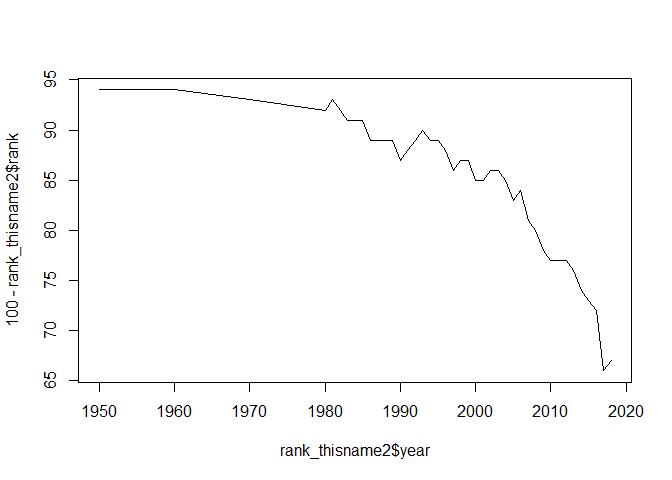<!-- -->

```r
#
# join them in a tibble 
mynames <- full_join(rank_thisname, rank_thisname2)
# plot
ggplot(mynames, aes(x = as.numeric(year), y = 100-rank, color=name)) + 
  geom_line()
```

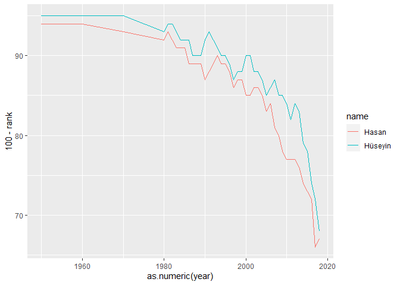<!-- -->


5. Create a new tibble containing all names in 2017 and 2018 but they should be ranked according to the 2018 data. In the new data set, rows must contain names and columns must contain rankings. 

```r
# all names sorted according to rank in 2018 
sorted2018 <- mennames %>% 
  filter(year==2018) %>% 
  arrange(rank) 

sorted2018 %>%  head(5)
```

```
## # A tibble: 5 x 3
##   name      year   rank
##   <chr>     <chr> <dbl>
## 1 Yusuf     2018      1
## 2 Eymen     2018      2
## 3 Ömer Asaf 2018      3
## 4 Miraç     2018      4
## 5 Ömer      2018      5
```


```r
# Now do the following: 
# create a new data containing 2018 rankings 
# i.e. create a new variable rank2018 and delete year 
pop2018 <- tibble(name=sorted2018$name, rank2018=sorted2018$rank)
pop2018 %>% head(5)
```

```
## # A tibble: 5 x 2
##   name      rank2018
##   <chr>        <dbl>
## 1 Yusuf            1
## 2 Eymen            2
## 3 Ömer Asaf        3
## 4 Miraç            4
## 5 Ömer             5
```

```r
#
# Do exactly the same for 2017 
sorted2017 <- mennames %>% 
  filter(year==2017) %>% 
  arrange(desc(-rank))
pop2017 <- tibble(name=sorted2017$name,rank2017=sorted2017$rank)
#
pop2017 %>% head(5)
```

```
## # A tibble: 5 x 2
##   name  rank2017
##   <chr>    <dbl>
## 1 Yusuf        1
## 2 Eymen        2
## 3 Ömer         3
## 4 Emir         4
## 5 Miraç        5
```


```r
# join them on names 
popularnames1718 <- left_join(pop2017,pop2018)
#
popularnames1718 %>% head(10)
```

```
## # A tibble: 10 x 3
##    name      rank2017 rank2018
##    <chr>        <dbl>    <dbl>
##  1 Yusuf            1        1
##  2 Eymen            2        2
##  3 Ömer             3        5
##  4 Emir             4        9
##  5 Miraç            5        4
##  6 Mustafa          6        6
##  7 Ahmet            7        8
##  8 Ömer Asaf        8        3
##  9 Berat            9       17
## 10 Mehmet          10       11
```

```r
# view(popularnames1718)
```


## Exercises

1. Add rankings in 2015 and 2016 to the tibble `popularnames1718` created above. 
Call the new data set `popnames1518`. 

2. Carry out a similar analysis for women's names. The data set `kadin_isim_siralama2018.xls` is available in the Data folder. 

<div class="tocify-extend-page" data-unique="tocify-extend-page" style="height: 0;"></div>

