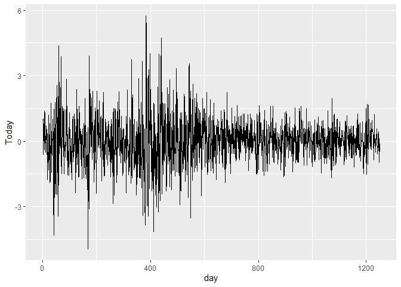
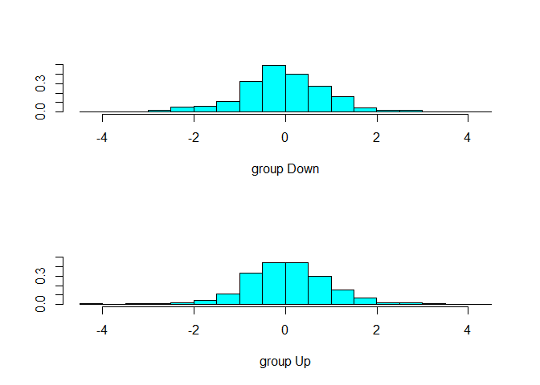

<style type="text/css"> 
body{
  background-color: #FAFAFA;
  font-size: 18px;
  line-height: 1.8; 
}
code.r{
  font-size: 12pt;
}
</style>


<br/>
<br/>


# Logistic regression 

## Example: Predicting the direction of the stock market 


```r
library(MASS)
library(ISLR)
library(tidyverse)

head(Smarket) 
```

```
##   Year   Lag1   Lag2   Lag3   Lag4   Lag5 Volume  Today Direction
## 1 2001  0.381 -0.192 -2.624 -1.055  5.010 1.1913  0.959        Up
## 2 2001  0.959  0.381 -0.192 -2.624 -1.055 1.2965  1.032        Up
## 3 2001  1.032  0.959  0.381 -0.192 -2.624 1.4112 -0.623      Down
## 4 2001 -0.623  1.032  0.959  0.381 -0.192 1.2760  0.614        Up
## 5 2001  0.614 -0.623  1.032  0.959  0.381 1.2057  0.213        Up
## 6 2001  0.213  0.614 -0.623  1.032  0.959 1.3491  1.392        Up
```
The data set `Smarket` contains daily returns of the SP500 index over the 1250 day period from 2001 to 2005. The column `Today` is today's return and its sign is represented in the column Direction as either Up or Down. The data set also contains volume information along with 5-day lagged values of daily returns. 

Here is the graph of daily returns: 

```r
Smarket %>% 
  mutate(day=1:nrow(Smarket)) %>% 
  ggplot(aes(x=day,y=Today)) + 
  geom_line()
```

<!-- -->

Based on the past information can we predict the direction (ie, the sign of the today's return, up or down) ?

```r
table(Smarket$Direction)/1250
```

```
## 
##   Down     Up 
## 0.4816 0.5184
```

```r
Smarket %>%  
  ggplot(aes(x=Today)) + 
  geom_histogram()
```

<!-- -->


Fit a **logistic regression** using `glm()` function: 


```r
# Logistic regression 
glm.fit <- glm(Direction ~ Lag1 + Lag2 + Lag3 +
                 Lag4 + Lag5 + Volume, data=Smarket, family=binomial)
summary(glm.fit) 
```

```
## 
## Call:
## glm(formula = Direction ~ Lag1 + Lag2 + Lag3 + Lag4 + Lag5 + 
##     Volume, family = binomial, data = Smarket)
## 
## Deviance Residuals: 
##    Min      1Q  Median      3Q     Max  
## -1.446  -1.203   1.065   1.145   1.326  
## 
## Coefficients:
##              Estimate Std. Error z value Pr(>|z|)
## (Intercept) -0.126000   0.240736  -0.523    0.601
## Lag1        -0.073074   0.050167  -1.457    0.145
## Lag2        -0.042301   0.050086  -0.845    0.398
## Lag3         0.011085   0.049939   0.222    0.824
## Lag4         0.009359   0.049974   0.187    0.851
## Lag5         0.010313   0.049511   0.208    0.835
## Volume       0.135441   0.158360   0.855    0.392
## 
## (Dispersion parameter for binomial family taken to be 1)
## 
##     Null deviance: 1731.2  on 1249  degrees of freedom
## Residual deviance: 1727.6  on 1243  degrees of freedom
## AIC: 1741.6
## 
## Number of Fisher Scoring iterations: 3
```

Now we can predict the direction of the stock market using the `predict()` function. 


```r
glm.probs <- predict(glm.fit,type="response")
glm.probs[1:10]
```

```
##         1         2         3         4         5         6         7         8 
## 0.5070841 0.4814679 0.4811388 0.5152224 0.5107812 0.5069565 0.4926509 0.5092292 
##         9        10 
## 0.5176135 0.4888378
```

```r
contrasts(Smarket$Direction)
```

```
##      Up
## Down  0
## Up    1
```

The first 10 predicted probabilities are written above. Note that these are conditional success probabilities, ie., the probability of the stock market going UP, as indicated by the `contrasts()` (dummy equls 1 for UP).  

Now we need to convert these predicted probabilities into binary predictions as Up or down. 
We will classify days for which probability exceeds 0.5 as Up. Consider the following code chunk: 

```r
glm.pred <- rep("Down", 1250)
glm.pred[glm.probs>.5]="Up"
table(glm.pred, Smarket$Direction)
```

```
##         
## glm.pred Down  Up
##     Down  145 141
##     Up    457 507
```

```r
(507+145)/1250
```

```
## [1] 0.5216
```

```r
mean(glm.pred==Smarket$Direction)
```

```
## [1] 0.5216
```

The line `glm.pred <- rep("Down", 1250)` creates a vector whose elements are all 
"Down". The second line replaces those exceeding 0.5 by "Up". Then we create a table to compare predicted direction with the actual direction. This is called the confusion matrix. 

Diagonal entries of the confusion matrix represent correct classification whereas off-diagonal entries represent incorrect ones. For example, the model correctly classified 145 days as Down and 507 days as Up. With these numbers, logit model correctly predicted the movement of the stock market 52.16% of the time (this is also called the accuracy rate). This is not at all impressive. It is only marginally better than flipping a coin. Imagine a situation where we always predicted that the market will go Up. In that case our success rate would be 51.84% (= 100*648/1250) 

We can also use `confusionMatrix()` function from the `caret` package. The first input is the predictions and the second input is the actual values. Both must be factor variables with the same levels. 

```r
library(caret) 
# 
glm.pred <- as.factor(glm.pred)
# both predictions and actual must be factors with the same levels
confusionMatrix(glm.pred, Smarket$Direction, positive = "Up")
```

```
## Confusion Matrix and Statistics
## 
##           Reference
## Prediction Down  Up
##       Down  145 141
##       Up    457 507
##                                           
##                Accuracy : 0.5216          
##                  95% CI : (0.4935, 0.5496)
##     No Information Rate : 0.5184          
##     P-Value [Acc > NIR] : 0.4216          
##                                           
##                   Kappa : 0.0237          
##                                           
##  Mcnemar's Test P-Value : <2e-16          
##                                           
##             Sensitivity : 0.7824          
##             Specificity : 0.2409          
##          Pos Pred Value : 0.5259          
##          Neg Pred Value : 0.5070          
##              Prevalence : 0.5184          
##          Detection Rate : 0.4056          
##    Detection Prevalence : 0.7712          
##       Balanced Accuracy : 0.5116          
##                                           
##        'Positive' Class : Up              
## 
```

`confusionMatrix()` function produces a set of statistics along with additional measures such as sensitivity and specificity. In our problem, the sensitivity is the percentage of true upward movement that are identified, i.e., 507/(141+507)= 0.7824. The specificity is the percentage of downward movement that are correctly identified, i.e., 145/(145+457)= 0.2409. 


What is the error rate? The model incorrectly predicts 457+141 = 598 cases, about 47.8%. 
However, this is the **training error rate**. To get a more realistic assessment we need to evaluate the model using test data which is not used in the estimation of the model. 

To this end, we will create a training data set consisting of all observations from 2001 to 2004. The year 2005 will be used as the test data. Consider the following code chunk: 


```r
# train data indicator
train <- (Smarket$Year<2005)
# test data 
Smarket.2005 <- Smarket[!train,]
dim(Smarket.2005)
```

```
## [1] 252   9
```

```r
# actual direction in the test data
Direction.2005 <- Smarket$Direction[!train]
```

`train` is a Boolean vector that contains elements TRUE or FALSE. Basically it's an indicator for the observations that go into the training data.


```r
# Estimate the model using training data: 
glm.fit <- glm(Direction ~ Lag1 + Lag2 + Lag3 + Lag4 + Lag5 + Volume, data=Smarket,
               family=binomial, subset=train)

# obtain predicted probabilities using test data: 
glm.probs <- predict(glm.fit, Smarket.2005, type = "response")
```

Compare predicted movements to the actual movements in the 2005 test data. 

```r
glm.pred <- rep("Down",252)
# classify probs>0.5 as up
glm.pred[glm.probs>.5] <- "Up"
# table: 
table(glm.pred,Direction.2005)
```

```
##         Direction.2005
## glm.pred Down Up
##     Down   77 97
##     Up     34 44
```

```r
# % correctly predicted
mean(glm.pred == Direction.2005)
```

```
## [1] 0.4801587
```

```r
# % incorrect -- error rate
mean(glm.pred != Direction.2005)
```

```
## [1] 0.5198413
```

The test error rate is about 52%. This is worse than random guessing. It looks like we cannot predict the direction of the stock market with past data (as advocated by some forms of the efficient market hypothesis).  

The model above contains all 5 lags and the volume. Now let's estimate a smaller model that contains only the most recent two lags:  

```r
glm.fit <- glm(Direction ~ Lag1 + Lag2, data=Smarket, family=binomial, subset=train)
glm.probs <- predict(glm.fit, Smarket.2005, type="response")
glm.pred <- rep("Down",252)
glm.pred[glm.probs>.5] <- "Up"
table(glm.pred, Direction.2005)
```

```
##         Direction.2005
## glm.pred Down  Up
##     Down   35  35
##     Up     76 106
```

```r
mean(glm.pred == Direction.2005)
```

```
## [1] 0.5595238
```

```r
106/(106+76)
```

```
## [1] 0.5824176
```

Now 56% of the observations are classified correctly. But note that if we classified every day as Up naively, our success rate will also be 56% (141/252). Frow the confusion matrix we see that the accuracy is about 58%. 

We can also obtain predictions for a specific set of values. The following code chunk is an example: 

```r
predict(glm.fit, newdata = data.frame(Lag1=c(1.2,1.5),Lag2=c(1.1,-0.8)), type="response")
```

```
##         1         2 
## 0.4791462 0.4960939
```

# Linear Discriminant Analysis (LDA) 

The discriminant analysis attempts to model the distribution of the response variable $Y$ in each group separately and then use the Bayes theorem to obtain $Pr(Y|X)$. Linear discriminant analysis produces the same classification as linear probabability model. 

## LDA Example: Stock Market Direction 

This example is from the ISLR text. We use `lda()` function to obtain 
the predictions using only two lags as features. 


```r
library(MASS)
lda.fit <- lda(Direction ~ Lag1 + Lag2, data=Smarket, subset=train)
lda.fit
```

```
## Call:
## lda(Direction ~ Lag1 + Lag2, data = Smarket, subset = train)
## 
## Prior probabilities of groups:
##     Down       Up 
## 0.491984 0.508016 
## 
## Group means:
##             Lag1        Lag2
## Down  0.04279022  0.03389409
## Up   -0.03954635 -0.03132544
## 
## Coefficients of linear discriminants:
##             LD1
## Lag1 -0.6420190
## Lag2 -0.5135293
```

```r
plot(lda.fit)
```

<!-- -->

From the LDA fit we seet that the prior probabilities are 0.492 for "Down" and 0.508 for "Up". These probabilities are directly computed from the frequencies of each group in the training set. The output also contains information on the group means of each predictor (Lag1 and Lag2) in each group. These are used in the discriminant functions which are linear in $x$. The coefficients of linear discriminants are used to form the linear combination of Lag1 and Lag2 which are then used in the LDA decision rule. If $-0.642\times Lag1-0.514\times Lag2$ is large, then the LDA classifier will predict a market increase (up), and if it is small then the LDA classifier will predict a market decline (down). The `plot()` function produces plots of the linear discriminants, obtained by computing $-0.642\times Lag1-0.514\times Lag2$ for each of the training observations.  

The `predict()` function returns a list with three elements. The first element,
`class`, contains LDA’s predictions about the movement of the market.
The second element, `posterior`, is a matrix whose kth column contains the
posterior probability that the corresponding observation belongs to the kth
class (see Eq. 4.10 on p.139). Finally, `x` contains the linear discriminants,
described earlier.


```r
lda.pred <- predict(lda.fit, Smarket.2005)
names(lda.pred)
```

```
## [1] "class"     "posterior" "x"
```

Note that we used test data to compute the predictions. 

Let's compute the confusion matrix from the LDA predictions. 


```r
lda.class <- lda.pred$class
table(lda.class, Direction.2005)
```

```
##          Direction.2005
## lda.class Down  Up
##      Down   35  35
##      Up     76 106
```

```r
mean(lda.class==Direction.2005)
```

```
## [1] 0.5595238
```

This is identical to the logistic regression predictions. 

The Bayes classifier assigns an observation to the class for which the posterior probability is greatest. In our example, an observation to the "Up" group if 

$$
Pr(Direction=Up|Lag1,Lag2)>0.5
$$

The Bayes classifier uses a threshold of 50% for the posterior probability of Up to assign an observation to the "Up" group. Applying a 50% threshold to the posterior probabilities allows us to recreate the predictions: 

```r
sum(lda.pred$posterior[,1]>=.5)
```

```
## [1] 70
```

```r
sum(lda.pred$posterior[,1]<.5)
```

```
## [1] 182
```

# Quadratic Discriminant Analysis (QDA) 

 

## QDA Example: Stock Market Direction 

We use `qda()` function to implement QDA in R. 


```r
qda.fit=qda(Direction~Lag1+Lag2,data=Smarket,subset=train)
qda.fit
```

```
## Call:
## qda(Direction ~ Lag1 + Lag2, data = Smarket, subset = train)
## 
## Prior probabilities of groups:
##     Down       Up 
## 0.491984 0.508016 
## 
## Group means:
##             Lag1        Lag2
## Down  0.04279022  0.03389409
## Up   -0.03954635 -0.03132544
```

The `predict()` function works similar to LDA: 


```r
qda.class=predict(qda.fit,Smarket.2005)$class
table(qda.class,Direction.2005)
```

```
##          Direction.2005
## qda.class Down  Up
##      Down   30  20
##      Up     81 121
```

```r
mean(qda.class==Direction.2005)
```

```
## [1] 0.5992063
```

The output suggests that QDA predictions are accurate almost 60% of the time. 

# K-Nearest Neighbors (KNN)

## KNN Example: Stock Market Direction 

`knn()` function (part of the `class` library) can be used to perform K-Nearest Neighbor estimation. 


```r
library(class)
```

```r
knn(train, test, cl, k = 1,...)
```

Arguments: 

`train`: matrix or data frame of training set cases.

`test`: matrix or data frame of test set cases. A vector will be interpreted as a row vector for a single case.

`cl`: factor of true classifications of training set

`k`: number of neighbours considered.

See the help file for the rest of the arguments. 

Form the train and test matrices that include the the predictors and also the actual labels of the groups: 

```r
library(class)
train.X <- cbind(Smarket$Lag1, Smarket$Lag2)[train,]
test.X <- cbind(Smarket$Lag1, Smarket$Lag2)[!train,]
train.Direction <- Smarket$Direction[train]
```

Now, perform KNN with k=1: 

```r
set.seed(1)
knn.pred <- knn(train.X,test.X,train.Direction,k=1)
table(knn.pred,Direction.2005)
```

```
##         Direction.2005
## knn.pred Down Up
##     Down   43 58
##     Up     68 83
```

```r
(83+43)/252
```

```
## [1] 0.5
```

The accuracy is 50% when k=1. Let's try k=3: 

```r
knn.pred <- knn(train.X, test.X, train.Direction, k=3)
table(knn.pred,Direction.2005)
```

```
##         Direction.2005
## knn.pred Down Up
##     Down   48 54
##     Up     63 87
```

```r
mean(knn.pred==Direction.2005)
```

```
## [1] 0.5357143
```

There is a slight improvement with 53.6% accuracy. 

Try k=5: 

```r
knn.pred <- knn(train.X, test.X, train.Direction, k=5)
table(knn.pred,Direction.2005)
```

```
##         Direction.2005
## knn.pred Down Up
##     Down   40 59
##     Up     71 82
```

```r
mean(knn.pred==Direction.2005)
```

```
## [1] 0.484127
```

This is even worse. 

# Exercise

Use `Default` data set, a simulated data set from the ISLR package, to compute predictions for the default status (YES/NO) using logistic regression, LDA, QDA, and KNN (use k=1,2,3). 


```r
library(ISLR)
data(Default)
contrasts(Default$default)
```

```
##     Yes
## No    0
## Yes   1
```

```r
summary(Default)
```

```
##  default    student       balance           income     
##  No :9667   No :7056   Min.   :   0.0   Min.   :  772  
##  Yes: 333   Yes:2944   1st Qu.: 481.7   1st Qu.:21340  
##                        Median : 823.6   Median :34553  
##                        Mean   : 835.4   Mean   :33517  
##                        3rd Qu.:1166.3   3rd Qu.:43808  
##                        Max.   :2654.3   Max.   :73554
```

Use balance, income, and student (dummy) as predictors. For example 

```r
# Logistic regression 
logit.default <- glm(default ~ balance + income + student, data=Default, family=binomial)
summary(logit.default ) 
```

```
## 
## Call:
## glm(formula = default ~ balance + income + student, family = binomial, 
##     data = Default)
## 
## Deviance Residuals: 
##     Min       1Q   Median       3Q      Max  
## -2.4691  -0.1418  -0.0557  -0.0203   3.7383  
## 
## Coefficients:
##               Estimate Std. Error z value Pr(>|z|)    
## (Intercept) -1.087e+01  4.923e-01 -22.080  < 2e-16 ***
## balance      5.737e-03  2.319e-04  24.738  < 2e-16 ***
## income       3.033e-06  8.203e-06   0.370  0.71152    
## studentYes  -6.468e-01  2.363e-01  -2.738  0.00619 ** 
## ---
## Signif. codes:  0 '***' 0.001 '**' 0.01 '*' 0.05 '.' 0.1 ' ' 1
## 
## (Dispersion parameter for binomial family taken to be 1)
## 
##     Null deviance: 2920.6  on 9999  degrees of freedom
## Residual deviance: 1571.5  on 9996  degrees of freedom
## AIC: 1579.5
## 
## Number of Fisher Scoring iterations: 8
```

Now, compute the predictions from logistic regression and then form the confusion matrix. Use LDA to compute predictions and form the confusion matrix. You should be able 
to reproduce Table 4.4 on page 145.


<div class="tocify-extend-page" data-unique="tocify-extend-page" style="height: 0;"></div>


